# **JOBSHEET 12 STREAMS**

## **Praktikum 1: Dart Streams**

### **Langkah 1: Buat Project Baru**
Buatlah sebuah project flutter baru dengan nama stream_nama (beri nama panggilan Anda) di folder week-13/src/ repository GitHub Anda.


### **Langkah 2: Buka file main.dart**
Ketiklah kode seperti berikut ini.

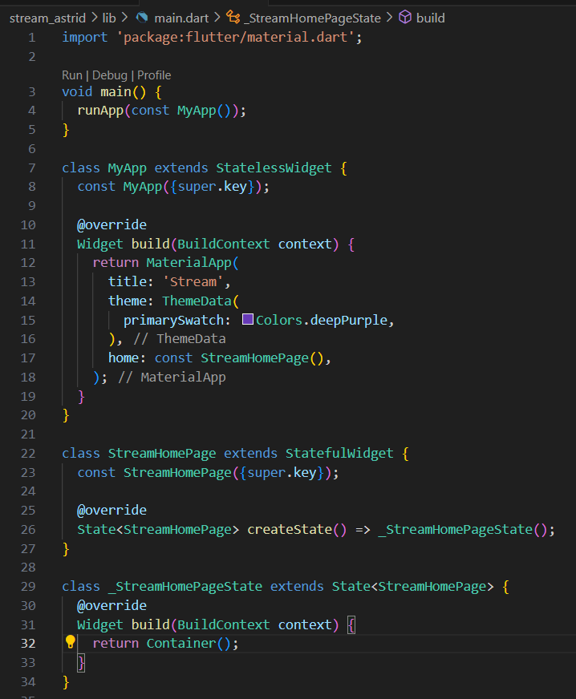

```dart
import 'package:flutter/material.dart';

void main() {
  runApp(const MyApp());
}

class MyApp extends StatelessWidget {
  const MyApp({super.key});

  @override
  Widget build(BuildContext context) {
    return MaterialApp(
      title: 'Stream',
      theme: ThemeData(
        primarySwatch: Colors.deepPurple,
      ),
      home: const StreamHomePage(),
    );
  }
}

class StreamHomePage extends StatefulWidget {
  const StreamHomePage({super.key});

  @override
  State<StreamHomePage> createState() => _StreamHomePageState();
}

class _StreamHomePageState extends State<StreamHomePage> {
  @override
  Widget build(BuildContext context) {
    return Container();
  }
}
```

### **Soal 1**
* Tambahkan nama panggilan Anda pada title app sebagai identitas hasil pekerjaan Anda.
* Gantilah warna tema aplikasi sesuai kesukaan Anda.
**Jawab:**
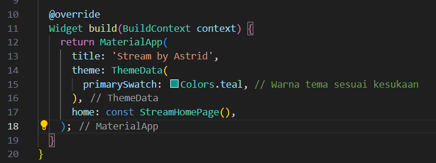
* Lakukan commit hasil jawaban Soal 1 dengan pesan "W13: Jawaban Soal 1"

### **Langkah 3: Buat file baru stream.dart**
Buat file baru di folder lib project Anda. Lalu isi dengan kode berikut.


### **Langkah 4: Tambah variabel colors**
Tambahkan variabel di dalam class ColorStream seperti berikut.

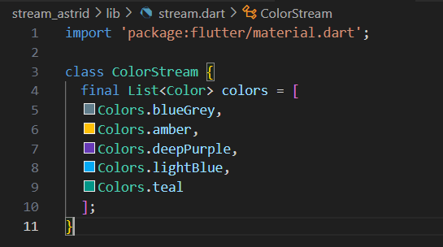

import 'package:flutter/material.dart';

```dart
class ColorStream {
  final List<Color> colors = [
  Colors.blueGrey,
  Colors.amber,
  Colors.deepPurple,
  Colors.lightBlue,
  Colors.teal
  ];
}
```

### **Soal 2**
* Tambahkan 5 warna lainnya sesuai keinginan Anda pada variabel colors tersebut.
**Jawab:**
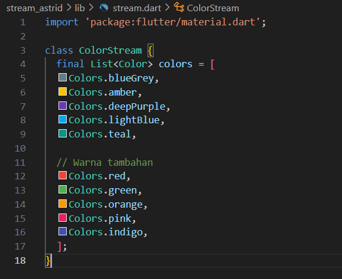
* Lakukan commit hasil jawaban Soal 2 dengan pesan "W13: Jawaban Soal 2"

### **Langkah 5: Tambah method getColors()**
Di dalam class ColorStream ketik method seperti kode berikut. Perhatikan tanda bintang di akhir keyword async* (ini digunakan untuk melakukan Stream data)


### **Langkah 6: Tambah perintah yield***
Tambahkan kode berikut ini.

```dart
Stream<Color> getColors() async* {
    yield* Stream.periodic(
      const Duration(seconds: 1), (int t) {
        int index = t % colors.length;
       return colors[index];
    });
  }
```

### **Soal 3**
* Jelaskan fungsi keyword yield* pada kode tersebut!

    **Jawab:**

    yield* adalah keyword dalam Dart yang digunakan untuk mendelegasikan kontrol kepada iterable atau stream lain. Artinya, yield* memungkinkan untuk menghasilkan (yield) semua nilai dari iterable atau stream yang disebutkan, seolah-olah nilai-nilai tersebut adalah bagian langsung dari fungsi generator tempat yield* digunakan.
* Apa maksud isi perintah kode tersebut?

    **Jawab:**

    Kode ini menghasilkan stream warna secara berkala (1 detik sekali) dengan urutan warna yang berulang dari daftar colors. Setiap warna dihasilkan berdasarkan indeks yang dihitung menggunakan modulus (%) pada penghitung waktu t.

Lakukan commit hasil jawaban Soal 3 dengan pesan "W13: Jawaban Soal 3"

### **Langkah 7: Buka main.dart**
Ketik kode impor file ini pada file main.dart
```dart
import 'stream.dart';
```

### **Langkah 8: Tambah variabel**
Ketik dua properti ini di dalam class _StreamHomePageState

```dart
Color bgColor = Colors.blueGrey;
late ColorStream colorStream;
```

### **Langkah 9: Tambah method changeColor()**
Tetap di file main, Ketik kode seperti berikut

```dart
void changeColor() async {
      await for (var eventColor in colorStream.getColors()) {
        setState(() {
        bgColor = eventColor;
       });
      }
    }
```

### **Langkah 10: Lakukan override initState()**
Ketika kode seperti berikut

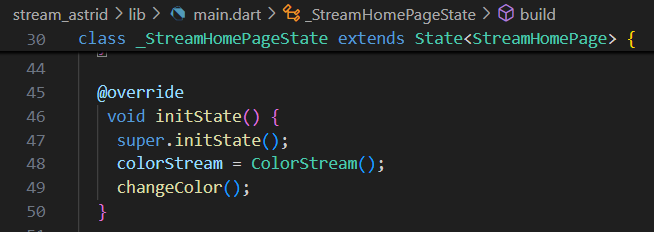

### **Langkah 11: Ubah isi Scaffold()**
Sesuaikan kode seperti berikut.

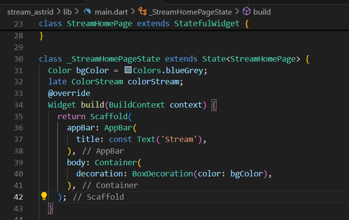

### **Langkah 12: Run**
Lakukan running pada aplikasi Flutter Anda, maka akan terlihat berubah warna background setiap detik.

**Soal 4**
* Capture hasil praktikum Anda berupa GIF dan lampirkan di README.

**Hasil**

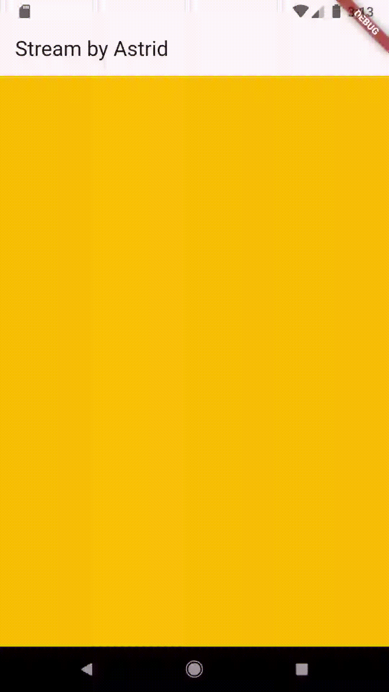

****Langkah 13: Ganti isi method changeColor()****
Anda boleh comment atau hapus kode sebelumnya, lalu ketika kode seperti berikut.

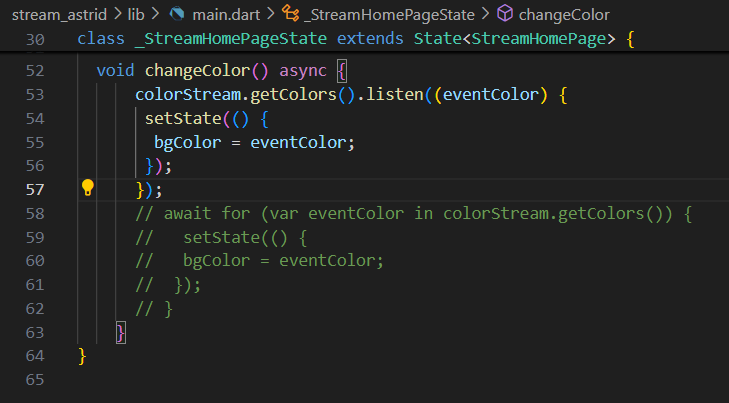

### **Soal 5**
* Jelaskan perbedaan menggunakan listen dan await for (langkah 9) !

**Jawab:**

**Perbedaan listen dan await for:**

* listen: Menangani stream dengan callback, cocok untuk stream yang menghasilkan data secara terus-menerus.
* await for: Blokir sementara kode berikutnya sampai semua elemen stream selesai diproses.

**Kode Lengkap**

**main.dart**

```dart
import 'package:flutter/material.dart';
import 'stream.dart';

void main() {
  runApp(const MyApp());
}

class MyApp extends StatelessWidget {
  const MyApp({super.key});

  @override
  Widget build(BuildContext context) {
    return MaterialApp(
      title: 'Stream by Astrid',
      theme: ThemeData(
        primarySwatch: Colors.teal, // Warna tema sesuai kesukaan
      ),
      home: const StreamHomePage(),
    );
  }
}

class StreamHomePage extends StatefulWidget {
  const StreamHomePage({super.key});

  @override
  State<StreamHomePage> createState() => _StreamHomePageState();
}

class _StreamHomePageState extends State<StreamHomePage> {
  Color bgColor = Colors.blueGrey;
  late ColorStream colorStream;
  @override
  Widget build(BuildContext context) {
    return Scaffold(
      appBar: AppBar(
        title: const Text('Stream by Astrid'),
      ),
      body: Container(
        decoration: BoxDecoration(color: bgColor),
      ),
    );
  }

  @override
   void initState() {
    super.initState();
    colorStream = ColorStream();
    changeColor();
  }

  void changeColor() async {
      colorStream.getColors().listen((eventColor) {
       setState(() {
        bgColor = eventColor;
       });
      });
      // await for (var eventColor in colorStream.getColors()) {
      //   setState(() {
      //   bgColor = eventColor;
      //  });
      // }
    }
}
```

**stream.dart**

```dart
import 'package:flutter/material.dart';

class ColorStream {
  final List<Color> colors = [
  Colors.blueGrey,
  Colors.amber,
  Colors.deepPurple,
  Colors.lightBlue,
  Colors.teal,

  // Warna tambahan
  Colors.red,
  Colors.green,
  Colors.orange,
  Colors.pink,
  Colors.indigo,
  ];

  Stream<Color> getColors() async* {
    yield* Stream.periodic(
      const Duration(seconds: 1), (int t) {
        int index = t % colors.length;
       return colors[index];
    });
  }
}
```


## **Praktikum 2: Stream controllers dan sinks**

### **Langkah 1: Buka file stream.dart**
Lakukan impor dengan mengetik kode ini.

```dart
import 'dart:async';
```

### **Langkah 2: Tambah class NumberStream**
Tetap di file stream.dart tambah class baru seperti berikut.


### **Langkah 3: Tambah StreamController**
Di dalam class NumberStream buatlah variabel seperti berikut.

```dart
final StreamController<int> controller = StreamController<int>();
```

### **Langkah 4: Tambah method addNumberToSink**
Tetap di class NumberStream buatlah method ini

```dart
class NumberStream {
  final StreamController<int> controller = StreamController<int>();
  void addNumberToSink(int newNumber) {
    controller.sink.add(newNumber);
  }
}
```
### **Langkah 5: Tambah method close()**

```dart
class NumberStream {
  final StreamController<int> controller = StreamController<int>();
  void addNumberToSink(int newNumber) {
    controller.sink.add(newNumber);
  }

  close() {
    controller.close();
  }
}
```
### **Langkah 6: Buka main.dart**
Ketik kode import seperti berikut
```dart
import 'dart:async';
import 'dart:math';
```

### **Langkah 7: Tambah variabel**
Di dalam class _StreamHomePageState ketik variabel berikut

```dart
int lastNumber = 0;
  late StreamController numberStreamController;
  late NumberStream numberStream;
```

### **Langkah 8: Edit initState()**

```dart
  @override
   void initState() {
    numberStream = NumberStream();
    numberStreamController = numberStream.controller;
    Stream stream = numberStreamController.stream;
    stream.listen((event) {
      setState(() {
        lastNumber = event;
      });
    });
    super.initState();
  }
```

### **Langkah 9: Edit dispose()**

```dart
  @override
    void dispose() {
      numberStreamController.close();
      super.dispose();
    }
```

### **Langkah 10: Tambah method addRandomNumber()**
```dart
void addRandomNumber() {
  Random random = Random();
  int myNum = random.nextInt(10);
  numberStream.addNumberToSink(myNum);
}
```

### **Langkah 11: Edit method build()**

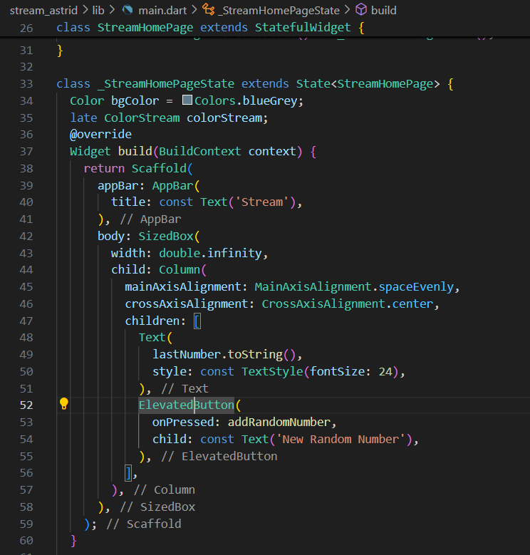

```dart
body: SizedBox(
        width: double.infinity,
        child: Column(
          mainAxisAlignment: MainAxisAlignment.spaceEvenly,
          crossAxisAlignment: CrossAxisAlignment.center,
          children: [
            Text(
              lastNumber.toString(),
              style: TextStyle(fontSize: 24),
            ),
            ElevatedButton(
              onPressed: addRandomNumber,
              child: Text('New Random Number'),
            ),
          ],
        ),
      ),
```

### **Langkah 12: Run**
Lakukan running pada aplikasi Flutter Anda, maka akan terlihat seperti gambar berikut.

### **Soal 6**
* Jelaskan maksud kode langkah 8 dan 10 tersebut!

**Jawab:**

**Langkah 8**
* numberStream = NumberStream();
    Membuat instance dari kelas NumberStream yang berisi StreamController. Ini digunakan untuk menghasilkan dan mengelola data dalam bentuk aliran (stream).

* numberStreamController = numberStream.controller;
    Menghubungkan variabel numberStreamController ke StreamController yang ada di dalam kelas NumberStream. Dengan ini, kita dapat berkomunikasi dengan sink dan stream dari controller tersebut.

* Stream stream = numberStreamController.stream;
    Mendapatkan stream dari controller untuk mendengarkan data yang dikirim melalui sink.

* stream.listen((event) {...});
    Menambahkan pendengar (listener) ke dalam stream untuk menangkap data baru yang ditambahkan ke sink. Dalam hal ini, setiap data baru akan diperbarui ke variabel lastNumber menggunakan setState(), sehingga UI akan terupdate.

**Langkah 10**

* Random random = Random();
    Membuat instance dari kelas Random untuk menghasilkan angka acak.

* int myNum = random.nextInt(10);
    Menghasilkan angka acak dari 0 hingga 9 menggunakan metode nextInt().

* numberStream.addNumberToSink(myNum);
    Memanggil metode addNumberToSink() dari instance NumberStream untuk mengirim angka acak yang dihasilkan ke sink. Data ini kemudian dapat didengar oleh listener di stream (Langkah 8).

Capture hasil praktikum Anda berupa GIF dan lampirkan di README.
Lalu lakukan commit dengan pesan "W13: Jawaban Soal 6".

**Hasil**


**Langkah 13: Buka stream.dart**
Tambahkan method berikut ini.

```dart
addError() {
    controller.sink.addError('error');
  }
```

### **Langkah 14: Buka main.dart**
Tambahkan method onError di dalam class StreamHomePageState pada method listen di fungsi initState() seperti berikut ini.

```dart
stream.listen((event) {
        setState(() {
          lastNumber = event;
        });
      },
      onError: (error) {
        setState(() {
          lastNumber = -1;
        });
      },
    );
```

### **Langkah 15: Edit method addRandomNumber()**
Lakukan comment pada dua baris kode berikut, lalu ketik kode seperti berikut ini.

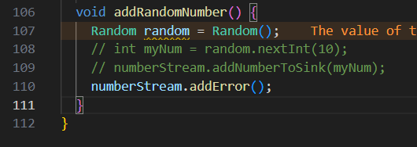

### **Soal 7**
* Jelaskan maksud kode langkah 13 sampai 15 tersebut!

    **Jawab:** 

    **Langkah 13:**

    Metode addError() digunakan untuk memasukkan error ke dalam stream secara manual. Ini berguna untuk menguji pengelolaan error oleh aplikasi.

    **Langkah 14:**

    onError pada listener diatur untuk menangani error yang diterima dari stream. Jika error diterima, nilai lastNumber diatur menjadi -1 untuk memberi tahu pengguna bahwa ada kesalahan.

    **Langkah 15:**
    Metode addRandomNumber() dimodifikasi untuk menggabungkan logika pengiriman data dan simulasi error. Jika angka acak kurang dari 5, aplikasi memicu error menggunakan addError(); jika tidak, angka acak dikirim ke stream seperti biasa.


* Kembalikan kode seperti semula pada Langkah 15, comment addError() agar Anda dapat melanjutkan ke praktikum 3 berikutnya.

    **Jawab:**

    

**Kode Lengkap**

**main.dart**
```dart
import 'package:flutter/material.dart';
import 'stream.dart';
import 'dart:async';
import 'dart:math';

void main() {
  runApp(const MyApp());
}

class MyApp extends StatelessWidget {
  const MyApp({super.key});

  @override
  Widget build(BuildContext context) {
    return MaterialApp(
      title: 'Stream by Astrid',
      theme: ThemeData(
        primarySwatch: Colors.teal, // Warna tema sesuai kesukaan
      ),
      home: const StreamHomePage(),
    );
    
  }
}

class StreamHomePage extends StatefulWidget {
  const StreamHomePage({super.key});

  @override
  State<StreamHomePage> createState() => _StreamHomePageState();
}

class _StreamHomePageState extends State<StreamHomePage> {
  Color bgColor = Colors.blueGrey;
  late ColorStream colorStream;
  @override
  Widget build(BuildContext context) {
    return Scaffold(
      appBar: AppBar(
        title: const Text('Stream by Astrid'),
      ),
      body: SizedBox(
        width: double.infinity,
        child: Column(
          mainAxisAlignment: MainAxisAlignment.spaceEvenly,
          crossAxisAlignment: CrossAxisAlignment.center,
          children: [
            Text(
              lastNumber.toString(),
              style: const TextStyle(fontSize: 24),
            ),
            ElevatedButton(
              onPressed: addRandomNumber,
              child: const Text('New Random Number'),
            ),
          ],
        ),
      ),
    );
  }

  int lastNumber = 0;
  late StreamController numberStreamController;
  late NumberStream numberStream;
  
  @override
   void initState() {
    numberStream = NumberStream();
    numberStreamController = numberStream.controller;
    Stream stream = numberStreamController.stream;
    stream.listen((event) {
        setState(() {
          lastNumber = event;
        });
      },
      onError: (error) {
        setState(() {
          lastNumber = -1;
        });
      },
    );
    super.initState();
    // colorStream = ColorStream();
    // changeColor();
  }

  @override
    void dispose() {
      numberStreamController.close();
      super.dispose();
    }

  void changeColor() async {
      colorStream.getColors().listen((eventColor) {
       setState(() {
        bgColor = eventColor;
       });
      });
      // await for (var eventColor in colorStream.getColors()) {
      //   setState(() {
      //   bgColor = eventColor;
      //  });
      // }
    }

  void addRandomNumber() {
    Random random = Random();
    int myNum = random.nextInt(10);
    numberStream.addNumberToSink(myNum);
    // numberStream.addError();
  }
}
```

**stream.dart**
```dart
import 'package:flutter/material.dart';
import 'dart:async';

class ColorStream {
  final List<Color> colors = [
  Colors.blueGrey,
  Colors.amber,
  Colors.deepPurple,
  Colors.lightBlue,
  Colors.teal,

  // Warna tambahan
  Colors.red,
  Colors.green,
  Colors.orange,
  Colors.pink,
  Colors.indigo,
  ];

  Stream<Color> getColors() async* {
    yield* Stream.periodic(
      const Duration(seconds: 1), (int t) {
        int index = t % colors.length;
       return colors[index];
    });
  }
}

class NumberStream {
  final StreamController<int> controller = StreamController<int>();
  void addNumberToSink(int newNumber) {
    controller.sink.add(newNumber);
  }

  close() {
    controller.close();
  }

  addError() {
    controller.sink.addError('error');
  }
}
```

## **Praktikum 3: Injeksi data ke streams**

### **Langkah 1: Buka main.dart**
Tambahkan variabel baru di dalam class _StreamHomePageState
```dart
late StreamTransformer transformer;
```

### **Langkah 2: Tambahkan kode ini di initState**
```dart
 final transformer = StreamTransformer<int, int>.fromHandlers(
        handleData: (value, sink) {
          sink.add(value * 10);
        },
        handleError: (error, trace, sink) {
          sink.add(-1);
        },
        handleDone: (sink) => sink.close()
    );
```

### **Langkah 3: Tetap di initState**
Lakukan edit seperti kode berikut.
```dart
stream.transform(transformer).listen((event) {
        setState(() {
          lastNumber = event;
        });
      },
      onError: (error) {
        setState(() {
          lastNumber = -1;
        });
      },
    );
    super.initState();
```

### **Langkah 4: Run**
Terakhir, run atau tekan F5 untuk melihat hasilnya jika memang belum running. Bisa juga lakukan hot restart jika aplikasi sudah running. Maka hasilnya akan seperti gambar berikut ini. Anda akan melihat tampilan angka dari 0 hingga 90.

**Hasil**


**Kode Lengkap**

**main.dart**
```dart
import 'package:flutter/material.dart';
import 'stream.dart';
import 'dart:async';
import 'dart:math';

void main() {
  runApp(const MyApp());
}

class MyApp extends StatelessWidget {
  const MyApp({super.key});

  @override
  Widget build(BuildContext context) {
    return MaterialApp(
      title: 'Stream by Astrid',
      theme: ThemeData(
        primarySwatch: Colors.teal, // Warna tema sesuai kesukaan
      ),
      home: const StreamHomePage(),
    );
    
  }
}

class StreamHomePage extends StatefulWidget {
  const StreamHomePage({super.key});

  @override
  State<StreamHomePage> createState() => _StreamHomePageState();
}

class _StreamHomePageState extends State<StreamHomePage> {
  Color bgColor = Colors.blueGrey;
  late ColorStream colorStream;
  late StreamTransformer transformer;
  @override
  Widget build(BuildContext context) {
    return Scaffold(
      appBar: AppBar(
        title: const Text('Stream by Astrid'),
      ),
      body: SizedBox(
        width: double.infinity,
        child: Column(
          mainAxisAlignment: MainAxisAlignment.spaceEvenly,
          crossAxisAlignment: CrossAxisAlignment.center,
          children: [
            Text(
              lastNumber.toString(),
              style: const TextStyle(fontSize: 24),
            ),
            ElevatedButton(
              onPressed: addRandomNumber,
              child: const Text('New Random Number'),
            ),
          ],
        ),
      ),
    );
  }

  int lastNumber = 0;
  late StreamController numberStreamController;
  late NumberStream numberStream;
  
  @override
   void initState() {
    numberStream = NumberStream();
    numberStreamController = numberStream.controller;
    Stream stream = numberStreamController.stream;
      // Membuat transformer untuk memanipulasi stream
    final transformer = StreamTransformer<int, int>.fromHandlers(
        handleData: (value, sink) {
          sink.add(value * 10);
        },
        handleError: (error, trace, sink) {
          sink.add(-1);
        },
        handleDone: (sink) => sink.close()
    );
    // stream.listen((event) {
    stream.transform(transformer).listen((event) {
        setState(() {
          lastNumber = event;
        });
      },
      onError: (error) {
        setState(() {
          lastNumber = -1;
        });
      },
    );
    super.initState();
    // colorStream = ColorStream();
    // changeColor();
  }

  @override
    void dispose() {
      numberStreamController.close();
      super.dispose();
    }

  void changeColor() async {
      colorStream.getColors().listen((eventColor) {
       setState(() {
        bgColor = eventColor;
       });
      });
      // await for (var eventColor in colorStream.getColors()) {
      //   setState(() {
      //   bgColor = eventColor;
      //  });
      // }
    }

  void addRandomNumber() {
    Random random = Random();
    int myNum = random.nextInt(10);
    numberStream.addNumberToSink(myNum);
    // numberStream.addError();
  }
}
```

**stream.dart**
```dart
import 'package:flutter/material.dart';
import 'dart:async';

class ColorStream {
  final List<Color> colors = [
  Colors.blueGrey,
  Colors.amber,
  Colors.deepPurple,
  Colors.lightBlue,
  Colors.teal,

  // Warna tambahan
  Colors.red,
  Colors.green,
  Colors.orange,
  Colors.pink,
  Colors.indigo,
  ];

  Stream<Color> getColors() async* {
    yield* Stream.periodic(
      const Duration(seconds: 1), (int t) {
        int index = t % colors.length;
       return colors[index];
    });
  }
}

class NumberStream {
  final StreamController<int> controller = StreamController<int>();
  void addNumberToSink(int newNumber) {
    controller.sink.add(newNumber);
  }

  close() {
    controller.close();
  }

  addError() {
    controller.sink.addError('error');
  }
}
```

## **Praktikum 4: Subscribe ke stream events**

### **Langkah 1: Tambah variabel**
Tambahkan variabel berikut di class _StreamHomePageState
```dart
late StreamSubscription subscription;
```

### **Langkah 2: Edit initState()**
Edit kode seperti berikut ini.

```dart
void initState() {
    super.initState();
    numberStream = NumberStream();
    numberStreamController = numberStream.controller;

    // Menyusun stream dan mendengarkan perubahan data
    Stream stream = numberStreamController.stream;
    subscription = stream.listen(
      (event) {
        setState(() {
          lastNumber = event;
        });
      },
```

### **Langkah 3: Tetap di initState()**
Tambahkan kode berikut ini.

```dart
      subscription.onError((error) {
        setState(() {
          lastNumber = -1;
        });
      });
```

### **Langkah 4: Tambah properti onDone()**
Tambahkan dibawahnya kode ini setelah onError
```dart
subscription.onDone(() {
        print('OnDone was called');
      });
```

### **Langkah 5: Tambah method baru**
Ketik method ini di dalam class _StreamHomePageState
```dart
void stopStream() {
    numberStreamController.close();  
```

### **Langkah 6: Pindah ke method dispose()**
Jika method dispose() belum ada, Anda dapat mengetiknya dan dibuat override. Ketik kode ini didalamnya.
```dart
  @override
  void dispose() {
    subscription.cancel();  
    super.dispose();
  }
```

### **Langkah 7: Pindah ke method build()**
Tambahkan button kedua dengan isi kode seperti berikut ini.
```dart
ElevatedButton(
              onPressed: () => stopStream,
              child: const Text('Stop Subscription'),
            )
```

### **Langkah 8: Edit method addRandomNumber()**
Edit kode seperti berikut ini.

 ```dart
  void addRandomNumber() {
    Random random = Random();
    int myNum = random.nextInt(10);
    if (!numberStreamController.isClosed) {
      numberStream.addNumberToSink(myNum);
    } else {
      setState(() {
        lastNumber = -1;
      });
    }
  }
 ```

### **Langkah 9: Run**
Anda akan melihat dua button seperti gambar berikut.

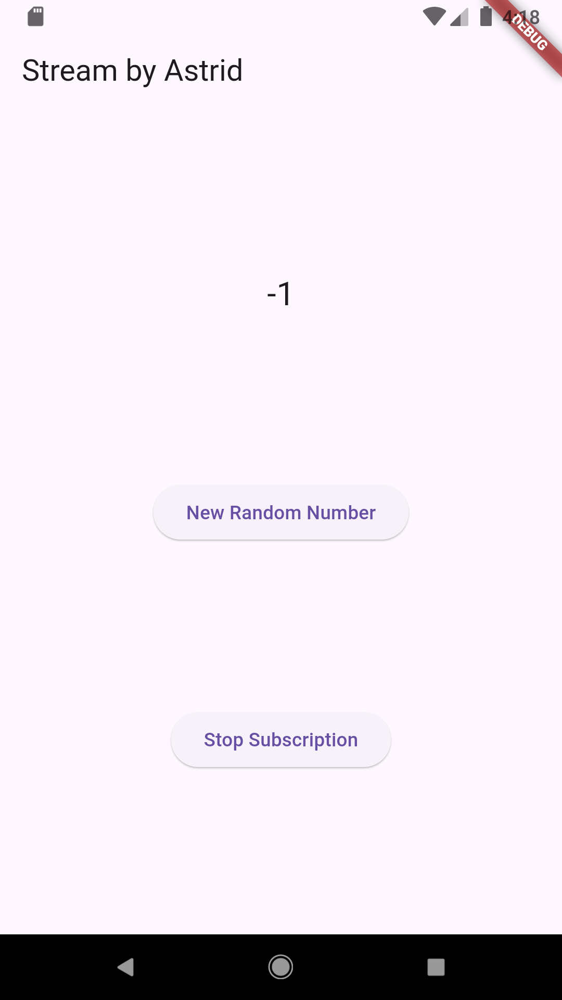

### **Langkah 10: Tekan button ‘Stop Subscription'**
Anda akan melihat pesan di Debug Console seperti berikut.


### **Soal 9**
* Jelaskan maksud kode langkah 2, 6 dan 8 tersebut!

**Jawab:**

**Langkah 2:**

Kode ini menginisialisasi stream dan mendengarkan perubahan data yang dikirimkan oleh stream. Ketika data baru diterima, setState() dipanggil untuk memperbarui UI.

**Langkah 6:**

Pada langkah ini, kita membatalkan subscription pada stream ketika widget dibuang (dispose()) untuk mencegah kebocoran memori dan memastikan tidak ada data yang diterima lagi setelah widget dihapus.

**Langkah 8:**

Kode ini memeriksa apakah StreamController masih terbuka sebelum menambahkan data baru ke stream. Jika stream sudah ditutup, nilai lastNumber diperbarui untuk menandakan kesalahan.


* Capture hasil praktikum Anda berupa GIF dan lampirkan di README.

**Hasil**

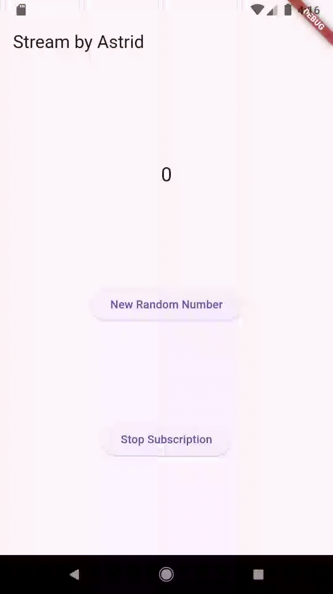

**Kode Lengkap**

**main.dart**

```dart
import 'package:flutter/material.dart';
import 'stream.dart';
import 'dart:async';
import 'dart:math';

void main() {
  runApp(const MyApp());
}

class MyApp extends StatelessWidget {
  const MyApp({super.key});

  @override
  Widget build(BuildContext context) {
    return MaterialApp(
      title: 'Stream by Astrid',
      theme: ThemeData(
        primarySwatch: Colors.teal, // Warna tema sesuai kesukaan
      ),
      home: const StreamHomePage(),
    );
  }
}

class StreamHomePage extends StatefulWidget {
  const StreamHomePage({super.key});

  @override
  State<StreamHomePage> createState() => _StreamHomePageState();
}

class _StreamHomePageState extends State<StreamHomePage> {
  Color bgColor = Colors.blueGrey;
  late ColorStream colorStream;
  late StreamTransformer transformer;
  late StreamSubscription subscription;

  int lastNumber = 0;
  late StreamController numberStreamController;
  late NumberStream numberStream;

  @override
  void initState() {
    super.initState();
    numberStream = NumberStream();
    numberStreamController = numberStream.controller;

    // Menyusun stream dan mendengarkan perubahan data
    Stream stream = numberStreamController.stream;
    subscription = stream.listen(
      (event) {
        setState(() {
          lastNumber = event;
        });
      });
      subscription.onError((error) {
        setState(() {
          lastNumber = -1;
        });
      });
      subscription.onDone(() {
        print('OnDone was called');
      });

    // Inisialisasi color stream dan mulai perubahan warna
    colorStream = ColorStream();
    changeColor();
  }

  @override
  void dispose() {
    subscription.cancel();  
    super.dispose();
  }

  // Mengubah warna latar belakang berdasarkan stream
  void changeColor() async {
    colorStream.getColors().listen((eventColor) {
      setState(() {
        bgColor = eventColor;
      });
    });
  }

  // Menghentikan stream
  void stopStream() {
    numberStreamController.close();  // Menutup stream controller jika diperlukan
  }

  // Menambahkan nomor acak ke stream
  void addRandomNumber() {
    Random random = Random();
    int myNum = random.nextInt(10);
    if (!numberStreamController.isClosed) {
      numberStream.addNumberToSink(myNum);
    } else {
      setState(() {
        lastNumber = -1;
      });
    }
  }

  @override
  Widget build(BuildContext context) {
    return Scaffold(
      appBar: AppBar(
        title: const Text('Stream by Astrid'),
      ),
      body: SizedBox(
        width: double.infinity,
        child: Column(
          mainAxisAlignment: MainAxisAlignment.spaceEvenly,
          crossAxisAlignment: CrossAxisAlignment.center,
          children: [
            Text(
              lastNumber.toString(),
              style: const TextStyle(fontSize: 24),
            ),
             ElevatedButton(
              onPressed: addRandomNumber,
              child: const Text('New Random Number'),
            ),
            ElevatedButton(
              onPressed: () => stopStream(),
              child: const Text('Stop Subscription'),
            ),
          ],
        ),
      ),
    );
  }
}
```

### **Praktikum 5: Multiple stream subscriptions**

### **Langkah 1: Buka file main.dart**
Ketik variabel berikut di class _StreamHomePageState
```dart
late StreamSubscription subscription2;
  String values = '';
```

### **Langkah 2: Edit initState()**
Ketik kode seperti berikut.
```dart
    subscription = stream.listen((event) {
        setState(() {
          values += '$event -';
          // lastNumber = event;
        });
      });
      subscription = stream.listen((event) {
        setState(() {
          values += '$event -';
        });
      });
```

### **Langkah 3: Run**
Lakukan run maka akan tampil error seperti gambar berikut.


### **Soal 10**
Jelaskan mengapa error itu bisa terjadi ?

**Jawab**

Error terjadi karena variabel subscription diinisialisasi dua kali untuk stream yang sama, yang menyebabkan konflik dalam mendengarkan data. Untuk memperbaikinya, hanya satu subscription yang dibutuhkan untuk stream, dan kedua pembaruan dapat dilakukan dalam satu listener.

### **Langkah 4: Set broadcast stream**
```dart
Ketik kode seperti berikut di method initState()
numberStream = NumberStream();
    numberStreamController = numberStream.controller;
    Stream stream = numberStreamController.stream.asBroadcastStream();
```

### **Langkah 5: Edit method build()**
Tambahkan text seperti berikut
```dart
child: Column(
          mainAxisAlignment: MainAxisAlignment.spaceEvenly,
          crossAxisAlignment: CrossAxisAlignment.center,
          children: [
            Text(values),
```

### **Langkah 6: Run**
Tekan button ‘New Random Number' beberapa kali, maka akan tampil teks angka terus bertambah sebanyak dua kali.


### **Soal 11**
* Jelaskan mengapa hal itu bisa terjadi ?

    **Jawab:**

    Hal ini terjadi karena setelah stream diubah menjadi broadcast stream, event yang sama diterima oleh lebih dari satu listener. Oleh karena itu, setiap event yang dihasilkan akan diproses oleh semua listener, menyebabkan pembaruan pada UI dua kali.

* Capture hasil praktikum Anda berupa GIF dan lampirkan di README.
Lalu lakukan commit dengan pesan "W13: Jawaban Soal 10,11".

**Hasil**


**Kode Lengkap**

**main.dart**
```dart
import 'package:flutter/material.dart';
import 'stream.dart';
import 'dart:async';
import 'dart:math';

void main() {
  runApp(const MyApp());
}

class MyApp extends StatelessWidget {
  const MyApp({super.key});

  @override
  Widget build(BuildContext context) {
    return MaterialApp(
      title: 'Stream by Astrid',
      theme: ThemeData(
        primarySwatch: Colors.teal, // Warna tema sesuai kesukaan
      ),
      home: const StreamHomePage(),
    );
  }
}

class StreamHomePage extends StatefulWidget {
  const StreamHomePage({super.key});

  @override
  State<StreamHomePage> createState() => _StreamHomePageState();
}

class _StreamHomePageState extends State<StreamHomePage> {
  Color bgColor = Colors.blueGrey;
  late ColorStream colorStream;
  late StreamTransformer transformer;
  late StreamSubscription subscription;
  late StreamSubscription subscription2;
  String values = '';

  int lastNumber = 0;
  late StreamController numberStreamController;
  late NumberStream numberStream;

  @override
  void initState() {
    numberStream = NumberStream();
    numberStreamController = numberStream.controller;
    Stream stream = numberStreamController.stream.asBroadcastStream();

    // Menyusun stream dan mendengarkan perubahan data
    // Stream stream = numberStreamController.stream;
    subscription = stream.listen((event) {
        setState(() {
          values += '$event -';
          // lastNumber = event;
        });
      });
      subscription = stream.listen((event) {
        setState(() {
          values += '$event -';
        });
      });
      subscription.onError((error) {
        setState(() {
          lastNumber = -1;
        });
      });
      subscription.onDone(() {
        print('OnDone was called');
      });

      super.initState();

    // Inisialisasi color stream dan mulai perubahan warna
    colorStream = ColorStream();
    changeColor();
  }

  @override
  void dispose() {
    subscription.cancel();  
    super.dispose();
  }

  // Mengubah warna latar belakang berdasarkan stream
  void changeColor() async {
    colorStream.getColors().listen((eventColor) {
      setState(() {
        bgColor = eventColor;
      });
    });
  }

  // Menghentikan stream
  void stopStream() {
    numberStreamController.close();  // Menutup stream controller jika diperlukan
  }

  // Menambahkan nomor acak ke stream
  void addRandomNumber() {
    Random random = Random();
    int myNum = random.nextInt(10);
    if (!numberStreamController.isClosed) {
      numberStream.addNumberToSink(myNum);
    } else {
      setState(() {
        lastNumber = -1;
      });
    }
  }

  @override
  Widget build(BuildContext context) {
    return Scaffold(
      appBar: AppBar(
        title: const Text('Stream by Astrid'),
      ),
      body: SizedBox(
        width: double.infinity,
        child: Column(
          mainAxisAlignment: MainAxisAlignment.spaceEvenly,
          crossAxisAlignment: CrossAxisAlignment.center,
          children: [
            Text(values),
            Text(
              lastNumber.toString(),
              style: const TextStyle(fontSize: 24),
            ),
             ElevatedButton(
              onPressed: addRandomNumber,
              child: const Text('New Random Number'),
            ),
            ElevatedButton(
              onPressed: () => stopStream(),
              child: const Text('Stop Subscription'),
            ),
          ],
        ),
      ),
    );
  }
}
```

## **Praktikum 6: StreamBuilder**

### **Langkah 1: Buat Project Baru**
Buatlah sebuah project flutter baru dengan nama streambuilder_nama (beri nama panggilan Anda) di folder week-13/src/ repository GitHub Anda.


### **Langkah 2: Buat file baru stream.dart**
Ketik kode ini

```dart
class NumberStream {}
```

### **Langkah 3: Tetap di file stream.dart**
Ketik kode seperti berikut.
```dart
import 'dart:math';

class NumberStream {
  Stream<int> getNumbers() async* {
    yield* Stream.periodic(const Duration(seconds: 1), (int t) {
      Random random = Random();
      int myNum = random.nextInt(10); // Menghasilkan angka acak antara 0 dan 9
      return myNum;
    });
  }
}
```

### **Langkah 4: Edit main.dart**
Ketik kode seperti berikut ini.
```dart
import 'package:flutter/material.dart';
import 'stream.dart';
import 'dart:async';

void main() {
  runApp(const MyApp());
}

class MyApp extends StatelessWidget {
  const MyApp({super.key});

  @override
  Widget build(BuildContext context) {
    return MaterialApp(
      title: 'Stream',
      theme: ThemeData(
        primarySwatch: Colors.deepPurple,
      ),
      home: const StreamHomePage(),
    );
  }
}

class StreamHomePage extends StatefulWidget {
  const StreamHomePage({super.key});

  @override
  State<StreamHomePage> createState() => _StreamHomePageState();
}

class _StreamHomePageState extends State<StreamHomePage> {
  @override
  Widget build(BuildContext context) {
    return Scaffold(
      appBar: AppBar(
        title: const Text('Stream'),
      ),
      body: Container(
      ),
    );
  }
}
```

### **Langkah 5: Tambah variabel**
Di dalam class _StreamHomePageState, ketika variabel ini.
```dart
late Stream<int> NumberStream;
```

### **Langkah 6: Edit initState()**
Ketik kode seperti berikut.

```dart
  @override
  void initState() {
    super.initState();
    numberStream = NumberStream().getNumbers(); 
  }

```
### **Langkah 7: Edit method build()**
```dart
body: StreamBuilder<int>(
        stream: numberStream, // Pastikan numberStream adalah Stream<int>
        initialData: 0,        // Nilai awal stream
        builder: (context, snapshot) {
          if (snapshot.hasError) {
            print('Error!');
            // Jika ada error, Anda bisa menampilkan pesan atau widget lainnya
            return Center(child: Text('Error: ${snapshot.error}'));
          }

          if (snapshot.hasData) {
            return Center(
              child: Text(
                snapshot.data.toString(),
                style: const TextStyle(fontSize: 96),
              ),
            );
          } else {
            // Menampilkan widget kosong jika tidak ada data
            return const SizedBox.shrink();
          }
        },
      ),
```

### **Langkah 8: Run**
Hasilnya, setiap detik akan tampil angka baru seperti berikut.

### **Soal 12**
* Jelaskan maksud kode pada langkah 3 dan 7 !

    **Jawab:**

    **Langkah 3:**
    
    Membuat stream yang menghasilkan angka acak setiap detik menggunakan Stream.periodic dan Random.

    **Langkah 7:** 
    
    Menampilkan angka acak yang diterima dari stream menggunakan StreamBuilder yang mengupdate tampilan setiap kali ada data baru.   

* Capture hasil praktikum Anda berupa GIF dan lampirkan di README.
Lalu lakukan commit dengan pesan "W13: Jawaban Soal 12".

    **Hasil**

    

**Kode Lengkap**

**main.dart**
```dart
import 'package:flutter/material.dart';
import 'stream.dart';
import 'dart:async';

void main() {
  runApp(const MyApp());
}

class MyApp extends StatelessWidget {
  const MyApp({super.key});

  @override
  Widget build(BuildContext context) {
    return MaterialApp(
      title: 'Stream by Astrid',
      theme: ThemeData(
        primarySwatch: Colors.deepPurple,
      ),
      home: const StreamHomePage(),
    );
  }
}

class StreamHomePage extends StatefulWidget {
  const StreamHomePage({super.key});

  @override
  State<StreamHomePage> createState() => _StreamHomePageState();
}

class _StreamHomePageState extends State<StreamHomePage> {
  late Stream<int> numberStream; // Perbaiki penamaan variabel

  @override
  void initState() {
    super.initState();
    numberStream = NumberStream().getNumbers(); 
  }

  @override
  Widget build(BuildContext context) {
    return Scaffold(
      appBar: AppBar(
        title: const Text('Stream by Astrid'),
      ),
      body: StreamBuilder<int>(
        stream: numberStream, // Pastikan numberStream adalah Stream<int>
        initialData: 0,        // Nilai awal stream
        builder: (context, snapshot) {
          if (snapshot.hasError) {
            print('Error!');
            // Jika ada error, Anda bisa menampilkan pesan atau widget lainnya
            return Center(child: Text('Error: ${snapshot.error}'));
          }

          if (snapshot.hasData) {
            return Center(
              child: Text(
                snapshot.data.toString(),
                style: const TextStyle(fontSize: 96),
              ),
            );
          } else {
            // Menampilkan widget kosong jika tidak ada data
            return const SizedBox.shrink();
          }
        },
      ),
    );
  }
}
```

**stream.dart**
```dart
import 'dart:math';

class NumberStream {
  Stream<int> getNumbers() async* {
    yield* Stream.periodic(const Duration(seconds: 1), (int t) {
      Random random = Random();
      int myNum = random.nextInt(10); // Menghasilkan angka acak antara 0 dan 9
      return myNum;
    });
  }
}
```

## **Praktikum 7: BLoC Pattern**

### **Langkah 1: Buat Project baru**
Buatlah sebuah project flutter baru dengan nama bloc_random_nama (beri nama panggilan Anda) di folder week-13/src/ repository GitHub Anda. Lalu buat file baru di folder lib dengan nama random_bloc.dart


### **Langkah 2: Isi kode random_bloc.dart**
Ketik kode impor berikut ini.
```dart
import 'dart:async';
import 'dart:math';
```

### **Langkah 3: Buat class RandomNumberBloc()**
```dart
class RandomNumberBloc {}
```

### **Langkah 4: Buat variabel StreamController**
Di dalam class RandomNumberBloc() ketik variabel berikut ini
```dart
// StreamController for input events
  final _generateRandomController = StreamController<void>();

// StreamController for output
  final _randomNumberController = StreamController<int>();

// Input Sink
  Sink<void> get generateRandom => _generateRandomController.sink;

// Output Stream
  Stream<int> get randomNumber => _randomNumberController.stream;
```

### **Langkah 5: Buat constructor**
```dart
RandomNumberBloc() {
    // Mendengarkan input dari _generateRandomController
    _generateRandomController.stream.listen((_) {
      // Menghasilkan angka acak antara 0 dan 9
      final random = Random().nextInt(10);

      // Menambahkan angka acak ke _randomNumberController
      _randomNumberController.sink.add(random);
    });
  }
```

### **Langkah 6: Buat method dispose()**
```dart
  void dispose() {
    _generateRandomController.close();
    _randomNumberController.close();
  }
```

### **Langkah 7: Edit main.dart**
```dart
import 'package:bloc_random_astrid/random_screen.dart';
import 'package:flutter/material.dart';

void main() {
  runApp(const MyApp());
}

class MyApp extends StatelessWidget {
  const MyApp({super.key});

  // This widget is the root of your application.
  @override
  Widget build(BuildContext context) {
    return MaterialApp(
      title: 'Flutter Demo',
      theme: ThemeData(
       primarySwatch: Colors.blue,
      ),
      home: const RandomScreen(),
    );
  }
}
```

### **Langkah 8: Buat file baru random_screen.dart**
Di dalam folder lib project Anda, buatlah file baru ini.

### **Langkah 9: Lakukan impor material dan random_bloc.dart**
Ketik kode ini di file baru random_screen.dart
```dart
import 'package:flutter/material.dart';
import 'random_bloc.dart';
```

### **Langkah 10: Buat StatefulWidget RandomScreen**
Buatlah di dalam file random_screen.dart
```dart
class RandomScreen extends StatefulWidget {
  const RandomScreen({super.key});

  @override
  State<RandomScreen> createState() => _RandomScreenState();
}
```

### **Langkah 11: Buat variabel**
Ketik kode ini di dalam class _RandomScreenState
```dart
final _bloc = RandomNumberBloc();
```

### **Langkah 12: Buat method dispose()**
Ketik kode ini di dalam class _StreamHomePageState
```dart
  @override
  void dispose() {
    _bloc.dispose(); // Menutup stream controller saat widget dihancurkan
    super.dispose();
  }

```

### **Langkah 13: Edit method build()**
Ketik kode ini di dalam class _StreamHomePageState
```dart
  @override
  Widget build(BuildContext context) {
    return Scaffold(
      appBar: AppBar(
        title: const Text('Random Number Astrid'),
      ),
      body: Center(
        child: StreamBuilder<int>(
          stream: _bloc.randomNumber,
          initialData: 0, // Nilai awal
          builder: (context, snapshot) {
              return Text(
                'Random Number: ${snapshot.data}',
                style: const TextStyle(fontSize: 24),
              );
            },         
          ),
        ),
      floatingActionButton: FloatingActionButton(
        onPressed: () => _bloc.generateRandom.add(null), // Memicu event generateRandom
        child: const Icon(Icons.refresh),
      ),
    );
  }
```

Run aplikasi, maka Anda akan melihat angka acak antara angka 0 sampai 9 setiap kali menekan tombol FloactingActionButton.


### **Soal 13**
* Jelaskan maksud praktikum ini ! Dimanakah letak konsep pola BLoC-nya ?

    **Jawab:**

    **Penjelasan Praktikum:**

    **Tujuan:**

    Menerapkan pola arsitektur BLoC (Business Logic Component) untuk memisahkan logika bisnis dari UI.

    **Konsep BLoC:**

    * StreamController: Digunakan untuk mengelola input dan output.
    * Sink: Menerima input berupa event.
    * Stream: Memberikan output berupa angka acak ke UI.
    * StreamBuilder: Komponen Flutter untuk menghubungkan stream dengan widget.

    **Letak Konsep BLoC:**

    * Input event (tombol ditekan) diproses di BLoC (RandomNumberBloc).
    * Hasil (angka acak) dikirimkan ke UI melalui stream.
    * UI tidak memiliki logika untuk menghitung angka acak, tetapi hanya menampilkan data yang dikirim dari BLoC.

    * Capture hasil praktikum Anda berupa GIF dan lampirkan di README.
    Lalu lakukan commit dengan pesan "W13: Jawaban Soal 13".

    **Hasil**

    

**Kode Lengkap**

**main.dart**
```dart
import 'package:bloc_random_astrid/random_screen.dart';
import 'package:flutter/material.dart';

void main() {
  runApp(const MyApp());
}

class MyApp extends StatelessWidget {
  const MyApp({super.key});

  // This widget is the root of your application.
  @override
  Widget build(BuildContext context) {
    return MaterialApp(
      title: 'Flutter Demo',
      theme: ThemeData(
       primarySwatch: Colors.blue,
      ),
      home: const RandomScreen(),
    );
  }
}
```

**random_bloc.dart**
```dart
import 'dart:async';
import 'dart:math';

class RandomNumberBloc {
  // StreamController for input events
  final _generateRandomController = StreamController<void>();

  // StreamController for output
  final _randomNumberController = StreamController<int>();

  // Input Sink
  Sink<void> get generateRandom => _generateRandomController.sink;

  // Output Stream
  Stream<int> get randomNumber => _randomNumberController.stream;

  RandomNumberBloc() {
    // Mendengarkan input dari _generateRandomController
    _generateRandomController.stream.listen((_) {
      // Menghasilkan angka acak antara 0 dan 9
      final random = Random().nextInt(10);

      // Menambahkan angka acak ke _randomNumberController
      _randomNumberController.sink.add(random);
    });
  }

  void dispose() {
    _generateRandomController.close();
    _randomNumberController.close();
  }
}
```

**random_screen.dart**
```dart
import 'package:flutter/material.dart';
import 'random_bloc.dart';

class RandomScreen extends StatefulWidget {
  const RandomScreen({super.key});

  @override
  State<RandomScreen> createState() => _RandomScreenState();
}

class _RandomScreenState extends State<RandomScreen> {
  final _bloc = RandomNumberBloc();

  @override
  void dispose() {
    _bloc.dispose(); 
    super.dispose();
  }

  @override
  Widget build(BuildContext context) {
    return Scaffold(
      appBar: AppBar(
        title: const Text('Random Number Astrid'),
      ),
      body: Center(
        child: StreamBuilder<int>(
          stream: _bloc.randomNumber,
          initialData: 0, // Nilai awal
          builder: (context, snapshot) {
              return Text(
                'Random Number: ${snapshot.data}',
                style: const TextStyle(fontSize: 24),
              );
            },         
          ),
        ),
      floatingActionButton: FloatingActionButton(
        onPressed: () => _bloc.generateRandom.add(null), // Memicu event generateRandom
        child: const Icon(Icons.refresh),
      ),
    );
  }
}
```