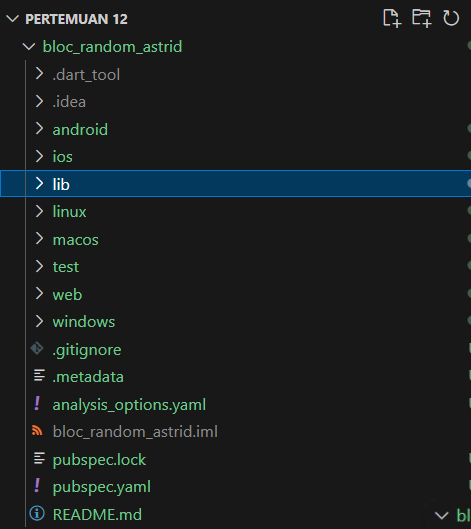
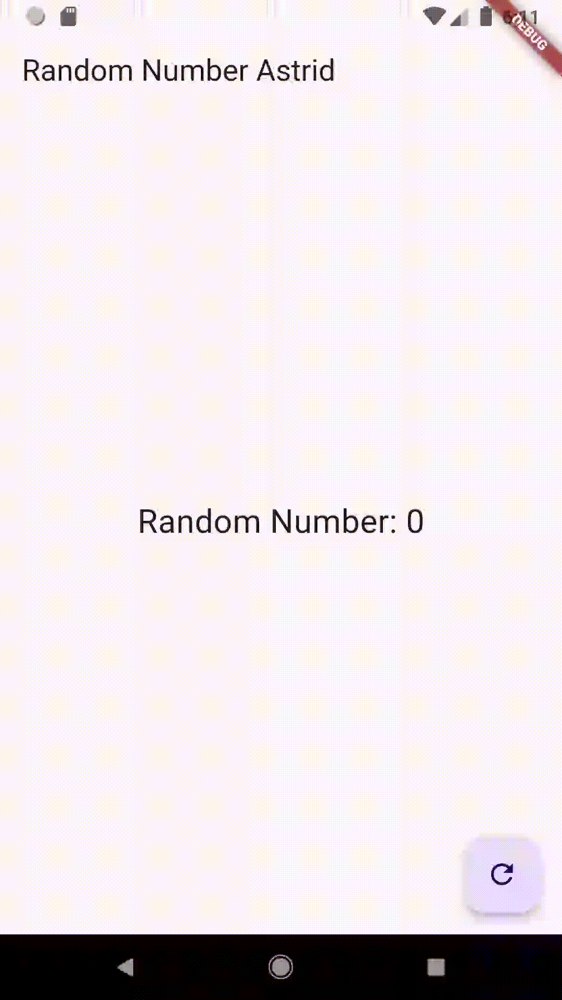

# **JOBSHEET 12 STREAMS**
## **Praktikum 7: BLoC Pattern**

### **Langkah 1: Buat Project baru**
Buatlah sebuah project flutter baru dengan nama bloc_random_nama (beri nama panggilan Anda) di folder week-13/src/ repository GitHub Anda. Lalu buat file baru di folder lib dengan nama random_bloc.dart



### **Langkah 2: Isi kode random_bloc.dart**
Ketik kode impor berikut ini.
```dart
import 'dart:async';
import 'dart:math';
```

### **Langkah 3: Buat class RandomNumberBloc()**
```dart
class RandomNumberBloc {}
```

### **Langkah 4: Buat variabel StreamController**
Di dalam class RandomNumberBloc() ketik variabel berikut ini
```dart
// StreamController for input events
  final _generateRandomController = StreamController<void>();

// StreamController for output
  final _randomNumberController = StreamController<int>();

// Input Sink
  Sink<void> get generateRandom => _generateRandomController.sink;

// Output Stream
  Stream<int> get randomNumber => _randomNumberController.stream;
```

### **Langkah 5: Buat constructor**
```dart
RandomNumberBloc() {
    // Mendengarkan input dari _generateRandomController
    _generateRandomController.stream.listen((_) {
      // Menghasilkan angka acak antara 0 dan 9
      final random = Random().nextInt(10);

      // Menambahkan angka acak ke _randomNumberController
      _randomNumberController.sink.add(random);
    });
  }
```

### **Langkah 6: Buat method dispose()**
```dart
  void dispose() {
    _generateRandomController.close();
    _randomNumberController.close();
  }
```

### **Langkah 7: Edit main.dart**
```dart
import 'package:bloc_random_astrid/random_screen.dart';
import 'package:flutter/material.dart';

void main() {
  runApp(const MyApp());
}

class MyApp extends StatelessWidget {
  const MyApp({super.key});

  // This widget is the root of your application.
  @override
  Widget build(BuildContext context) {
    return MaterialApp(
      title: 'Flutter Demo',
      theme: ThemeData(
       primarySwatch: Colors.blue,
      ),
      home: const RandomScreen(),
    );
  }
}
```

### **Langkah 8: Buat file baru random_screen.dart**
Di dalam folder lib project Anda, buatlah file baru ini.

### **Langkah 9: Lakukan impor material dan random_bloc.dart**
Ketik kode ini di file baru random_screen.dart
```dart
import 'package:flutter/material.dart';
import 'random_bloc.dart';
```

### **Langkah 10: Buat StatefulWidget RandomScreen**
Buatlah di dalam file random_screen.dart
```dart
class RandomScreen extends StatefulWidget {
  const RandomScreen({super.key});

  @override
  State<RandomScreen> createState() => _RandomScreenState();
}
```

### **Langkah 11: Buat variabel**
Ketik kode ini di dalam class _RandomScreenState
```dart
final _bloc = RandomNumberBloc();
```

### **Langkah 12: Buat method dispose()**
Ketik kode ini di dalam class _StreamHomePageState
```dart
  @override
  void dispose() {
    _bloc.dispose(); // Menutup stream controller saat widget dihancurkan
    super.dispose();
  }

```

### **Langkah 13: Edit method build()**
Ketik kode ini di dalam class _StreamHomePageState
```dart
  @override
  Widget build(BuildContext context) {
    return Scaffold(
      appBar: AppBar(
        title: const Text('Random Number Astrid'),
      ),
      body: Center(
        child: StreamBuilder<int>(
          stream: _bloc.randomNumber,
          initialData: 0, // Nilai awal
          builder: (context, snapshot) {
              return Text(
                'Random Number: ${snapshot.data}',
                style: const TextStyle(fontSize: 24),
              );
            },         
          ),
        ),
      floatingActionButton: FloatingActionButton(
        onPressed: () => _bloc.generateRandom.add(null), // Memicu event generateRandom
        child: const Icon(Icons.refresh),
      ),
    );
  }
```

Run aplikasi, maka Anda akan melihat angka acak antara angka 0 sampai 9 setiap kali menekan tombol FloactingActionButton.



### **Soal 13**
* Jelaskan maksud praktikum ini ! Dimanakah letak konsep pola BLoC-nya ?

    **Jawab:**

    **Penjelasan Praktikum:**

    **Tujuan:**

    Menerapkan pola arsitektur BLoC (Business Logic Component) untuk memisahkan logika bisnis dari UI.

    **Konsep BLoC:**

    * StreamController: Digunakan untuk mengelola input dan output.
    * Sink: Menerima input berupa event.
    * Stream: Memberikan output berupa angka acak ke UI.
    * StreamBuilder: Komponen Flutter untuk menghubungkan stream dengan widget.

    **Letak Konsep BLoC:**

    * Input event (tombol ditekan) diproses di BLoC (RandomNumberBloc).
    * Hasil (angka acak) dikirimkan ke UI melalui stream.
    * UI tidak memiliki logika untuk menghitung angka acak, tetapi hanya menampilkan data yang dikirim dari BLoC.

    * Capture hasil praktikum Anda berupa GIF dan lampirkan di README.
    Lalu lakukan commit dengan pesan "W13: Jawaban Soal 13".

    **Hasil**

    

**Kode Lengkap**

**main.dart**
```dart
import 'package:bloc_random_astrid/random_screen.dart';
import 'package:flutter/material.dart';

void main() {
  runApp(const MyApp());
}

class MyApp extends StatelessWidget {
  const MyApp({super.key});

  // This widget is the root of your application.
  @override
  Widget build(BuildContext context) {
    return MaterialApp(
      title: 'Flutter Demo',
      theme: ThemeData(
       primarySwatch: Colors.blue,
      ),
      home: const RandomScreen(),
    );
  }
}
```

**random_bloc.dart**
```dart
import 'dart:async';
import 'dart:math';

class RandomNumberBloc {
  // StreamController for input events
  final _generateRandomController = StreamController<void>();

  // StreamController for output
  final _randomNumberController = StreamController<int>();

  // Input Sink
  Sink<void> get generateRandom => _generateRandomController.sink;

  // Output Stream
  Stream<int> get randomNumber => _randomNumberController.stream;

  RandomNumberBloc() {
    // Mendengarkan input dari _generateRandomController
    _generateRandomController.stream.listen((_) {
      // Menghasilkan angka acak antara 0 dan 9
      final random = Random().nextInt(10);

      // Menambahkan angka acak ke _randomNumberController
      _randomNumberController.sink.add(random);
    });
  }

  void dispose() {
    _generateRandomController.close();
    _randomNumberController.close();
  }
}
```

**random_screen.dart**
```dart
import 'package:flutter/material.dart';
import 'random_bloc.dart';

class RandomScreen extends StatefulWidget {
  const RandomScreen({super.key});

  @override
  State<RandomScreen> createState() => _RandomScreenState();
}

class _RandomScreenState extends State<RandomScreen> {
  final _bloc = RandomNumberBloc();

  @override
  void dispose() {
    _bloc.dispose(); 
    super.dispose();
  }

  @override
  Widget build(BuildContext context) {
    return Scaffold(
      appBar: AppBar(
        title: const Text('Random Number Astrid'),
      ),
      body: Center(
        child: StreamBuilder<int>(
          stream: _bloc.randomNumber,
          initialData: 0, // Nilai awal
          builder: (context, snapshot) {
              return Text(
                'Random Number: ${snapshot.data}',
                style: const TextStyle(fontSize: 24),
              );
            },         
          ),
        ),
      floatingActionButton: FloatingActionButton(
        onPressed: () => _bloc.generateRandom.add(null), // Memicu event generateRandom
        child: const Icon(Icons.refresh),
      ),
    );
  }
}
```

