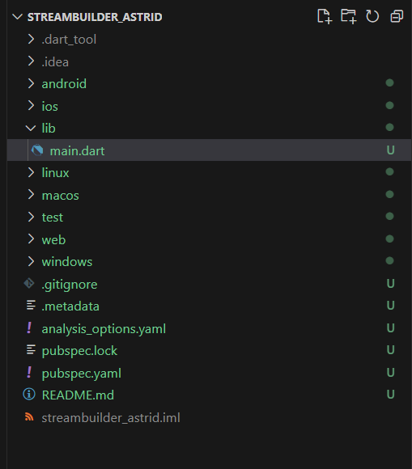
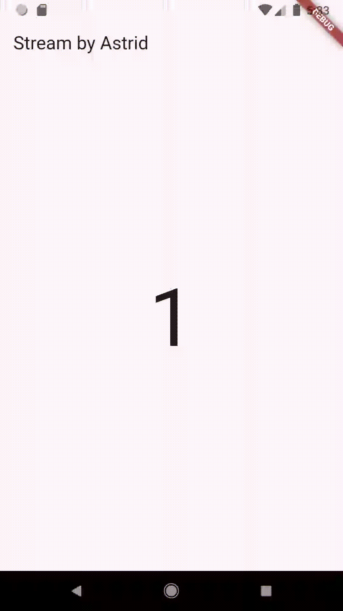

# **JOBSHEET 12 STREAMS**
## **Praktikum 6: StreamBuilder**

### **Langkah 1: Buat Project Baru**
Buatlah sebuah project flutter baru dengan nama streambuilder_nama (beri nama panggilan Anda) di folder week-13/src/ repository GitHub Anda.



### **Langkah 2: Buat file baru stream.dart**
Ketik kode ini

```dart
class NumberStream {}
```

### **Langkah 3: Tetap di file stream.dart**
Ketik kode seperti berikut.
```dart
import 'dart:math';

class NumberStream {
  Stream<int> getNumbers() async* {
    yield* Stream.periodic(const Duration(seconds: 1), (int t) {
      Random random = Random();
      int myNum = random.nextInt(10); // Menghasilkan angka acak antara 0 dan 9
      return myNum;
    });
  }
}
```

### **Langkah 4: Edit main.dart**
Ketik kode seperti berikut ini.
```dart
import 'package:flutter/material.dart';
import 'stream.dart';
import 'dart:async';

void main() {
  runApp(const MyApp());
}

class MyApp extends StatelessWidget {
  const MyApp({super.key});

  @override
  Widget build(BuildContext context) {
    return MaterialApp(
      title: 'Stream',
      theme: ThemeData(
        primarySwatch: Colors.deepPurple,
      ),
      home: const StreamHomePage(),
    );
  }
}

class StreamHomePage extends StatefulWidget {
  const StreamHomePage({super.key});

  @override
  State<StreamHomePage> createState() => _StreamHomePageState();
}

class _StreamHomePageState extends State<StreamHomePage> {
  @override
  Widget build(BuildContext context) {
    return Scaffold(
      appBar: AppBar(
        title: const Text('Stream'),
      ),
      body: Container(
      ),
    );
  }
}
```

### **Langkah 5: Tambah variabel**
Di dalam class _StreamHomePageState, ketika variabel ini.
```dart
late Stream<int> NumberStream;
```

### **Langkah 6: Edit initState()**
Ketik kode seperti berikut.

```dart
  @override
  void initState() {
    super.initState();
    numberStream = NumberStream().getNumbers(); 
  }

```
### **Langkah 7: Edit method build()**
```dart
body: StreamBuilder<int>(
        stream: numberStream, // Pastikan numberStream adalah Stream<int>
        initialData: 0,        // Nilai awal stream
        builder: (context, snapshot) {
          if (snapshot.hasError) {
            print('Error!');
            // Jika ada error, Anda bisa menampilkan pesan atau widget lainnya
            return Center(child: Text('Error: ${snapshot.error}'));
          }

          if (snapshot.hasData) {
            return Center(
              child: Text(
                snapshot.data.toString(),
                style: const TextStyle(fontSize: 96),
              ),
            );
          } else {
            // Menampilkan widget kosong jika tidak ada data
            return const SizedBox.shrink();
          }
        },
      ),
```

### **Langkah 8: Run**
Hasilnya, setiap detik akan tampil angka baru seperti berikut.

### **Soal 12**
* Jelaskan maksud kode pada langkah 3 dan 7 !

    **Jawab:**

    **Langkah 3: **
    
    Membuat stream yang menghasilkan angka acak setiap detik menggunakan Stream.periodic dan Random.

    **Langkah 7:** 
    
    Menampilkan angka acak yang diterima dari stream menggunakan StreamBuilder yang mengupdate tampilan setiap kali ada data baru.   

* Capture hasil praktikum Anda berupa GIF dan lampirkan di README.
Lalu lakukan commit dengan pesan "W13: Jawaban Soal 12".

    **Hasil**

    

**Kode Lengkap**

**main.dart**
```dart
import 'package:flutter/material.dart';
import 'stream.dart';
import 'dart:async';

void main() {
  runApp(const MyApp());
}

class MyApp extends StatelessWidget {
  const MyApp({super.key});

  @override
  Widget build(BuildContext context) {
    return MaterialApp(
      title: 'Stream by Astrid',
      theme: ThemeData(
        primarySwatch: Colors.deepPurple,
      ),
      home: const StreamHomePage(),
    );
  }
}

class StreamHomePage extends StatefulWidget {
  const StreamHomePage({super.key});

  @override
  State<StreamHomePage> createState() => _StreamHomePageState();
}

class _StreamHomePageState extends State<StreamHomePage> {
  late Stream<int> numberStream; // Perbaiki penamaan variabel

  @override
  void initState() {
    super.initState();
    numberStream = NumberStream().getNumbers(); 
  }

  @override
  Widget build(BuildContext context) {
    return Scaffold(
      appBar: AppBar(
        title: const Text('Stream by Astrid'),
      ),
      body: StreamBuilder<int>(
        stream: numberStream, // Pastikan numberStream adalah Stream<int>
        initialData: 0,        // Nilai awal stream
        builder: (context, snapshot) {
          if (snapshot.hasError) {
            print('Error!');
            // Jika ada error, Anda bisa menampilkan pesan atau widget lainnya
            return Center(child: Text('Error: ${snapshot.error}'));
          }

          if (snapshot.hasData) {
            return Center(
              child: Text(
                snapshot.data.toString(),
                style: const TextStyle(fontSize: 96),
              ),
            );
          } else {
            // Menampilkan widget kosong jika tidak ada data
            return const SizedBox.shrink();
          }
        },
      ),
    );
  }
}
```

**stream.dart**
```dart
import 'dart:math';

class NumberStream {
  Stream<int> getNumbers() async* {
    yield* Stream.periodic(const Duration(seconds: 1), (int t) {
      Random random = Random();
      int myNum = random.nextInt(10); // Menghasilkan angka acak antara 0 dan 9
      return myNum;
    });
  }
}

```