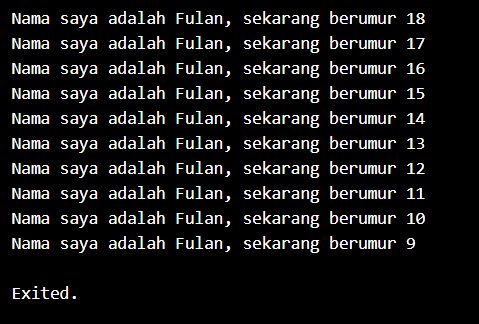

**Nama        : Astrid Risa Widiana**

**NIM         : 2241720250**

**Kelas/Absen : TI-3A/05**

# LAPORAN PRAKTIKUM JOBSHEET 2 -Pemrograman Dart
## Tugas Praktikum

**Soal 1**

Modifikasi Kode pada baris 3 di VS Code atau Editor Code favorit Anda berikut ini agar mendapatkan keluaran (output) sesuai yang diminta!

> Kode program sebelum modifikasi:
```dart
void main() {
  for (int i = 0; i < 10; i++) {
    print('Nama saya adalah Fulan, sekarang berumur ${18 - i}');
  }
}
```
> Output yang diinginkan:



**Soal 2**

Mengapa sangat penting untuk memahami bahasa pemrograman Dart sebelum kita menggunakan framework Flutter ? Jelaskan!
> **Jawab:** Memahami bahasa pemrograman Dart sangat penting sebelum menggunakan framework Flutter karena hal ini akan memudahkan kita dalam penggunaan Flutter dan membuat proses pengembangan menjadi lebih nyaman. Sebab, Flutter sepenuhnya dibangun menggunakan Dart, sehingga penguasaan bahasa ini diperlukan untuk memahami dan mengelola komponen aplikasi, logika, serta UI. Dengan pemahaman yang baik tentang Dart, pengembang akan lebih mudah dalam menangani fitur-fitur penting seperti pemrograman asinkron, debugging, dan hot reload, yang sangat penting dalam pengembangan aplikasi Flutter yang efisien.

**Soal 3**

Rangkumlah materi dari codelab ini menjadi poin-poin penting yang dapat Anda gunakan untuk membantu proses pengembangan aplikasi mobile menggunakan framework Flutter.
**Jawab:**
**Pentingnya Bahasa Dart Untuk Flutter**
Semua pengembangan framework Flutter melibatkan pengetahuan/fitur mendalam dengan bahasa Dart; Kode aplikasi, kode plugin, dan manajemen dependensi semuanya menggunakan bahasa Dart beserta fitur-fiturnya. Memiliki pemahaman dasar yang kuat tentang Dart akan memudahkan untuk menjadi lebih produktif dengan Flutter dan akan membuat Anda merasa nyaman dalam pengembangan Flutter.

**Fitur-fitur Dart**

a) Productive tooling: merupakan fitur kakas (tool) untuk menganalisis kode, plugin IDE, dan ekosistem paket yang besar.

b) Garbage collection: untuk mengelola atau menangani dealokasi memori (terutama memori yang ditempati oleh objek yang tidak lagi digunakan).

c) Type annotations (opsional): untuk keamanan dan konsistensi dalam mengontrol semua data dalam aplikasi.

d) Statically typed: Meskipun type annotations bersifat opsional, Dart tetap aman karena menggunakan fitur type-safe dan type inference untuk menganalisis types saat runtime. Fitur ini penting untuk menemukan bug selama kompilasi kode.

e) Portability: bahasa Dart tidak hanya untuk web (yang dapat diterjemahkan ke JavaScript) tetapi juga dapat dikompilasi secara native ke kode Advanced RISC Machines (ARM) dan x86.

**Evolusi Dart**

**Sejarah**

Diluncurkan pada tahun 2011, Dart telah berkembang sejak saat itu.Awalnya berfokus pada pengembangan web, dengan tujuan utama menggantikan JavaScript, sekarang telah fokus pada mobile development, termasuk framework Flutter.

**Perkembangan**

Dart merilis versi stabilnya pada tahun 2013, dengan perubahan besar termasuk dalam rilis Dart 2.0 menjelang akhir 2018,Dart dibuat untuk memperbaiki kekurangan JavaScript. Dart menawarkan performa tinggi dan dilengkapi dengan alat-alat modern untuk pengembangan. Dart juga fleksibel karena mendukung fitur pemrograman berorientasi objek (OOP).


**Cara Kerja Dart**

Cara kerja Dart melibatkan beberapa komponen inti untuk menjalankan dan mengoptimalkan kode. Berikut adalah penjelasan singkat tentang cara kerja Dart:

1. Dart VM (Virtual Machine):
  Dart memiliki Virtual Machine yang dapat mengeksekusi kode menggunakan dua metode:

    a) Just-In-Time (JIT) Compilation: Kompilasi JIT digunakan selama fase pengembangan. Dengan JIT, kode Dart dikompilasi dan dijalankan secara langsung, yang memungkinkan fitur seperti hot reload. Hot reload membantu pengembang melihat perubahan kode secara instan tanpa harus memulai ulang aplikasi.

    b) Ahead-Of-Time (AOT) Compilation: Untuk produksi, Dart menggunakan kompilasi AOT, yang mengonversi kode menjadi native ARM atau x86 sebelum aplikasi dijalankan. Kompilasi ini menghasilkan aplikasi yang lebih cepat dan efisien.

2. Kompilasi ke JavaScript:

    Dart juga bisa dikonversi menjadi kode JavaScript, sehingga aplikasi yang ditulis dengan Dart dapat dijalankan di browser. Ini penting untuk pengembangan aplikasi web yang menggunakan Flutter atau framework lain yang mendukung Dart.

3. Garbage Collection:

    Dart dilengkapi dengan mekanisme garbage collection yang secara otomatis mengelola dan melepaskan memori yang tidak lagi digunakan. Ini membantu mengoptimalkan penggunaan memori aplikasi dan mencegah kebocoran memori.

4. Hot Reload:

    Salah satu fitur unggulan Dart saat bekerja dengan Flutter adalah hot reload. Ini memungkinkan pengembang melihat perubahan kode secara langsung tanpa harus menghentikan dan menjalankan kembali aplikasi, sehingga mempercepat proses pengembangan.

Dengan kombinasi JIT untuk pengembangan cepat dan AOT untuk performa produksi, Dart menawarkan fleksibilitas dalam pengembangan aplikasi mobile, web, maupun server.


**Struktur Dasar Dart**

**Sintaks Dasar:**

Fungsi main() adalah titik awal eksekusi setiap program Dart dan harus ada di setiap aplikasi untuk memulai proses menjalankan kode.

**Operator:**

1. Aritmatika: Operator seperti +, -, *, /, ~/, % digunakan untuk melakukan operasi matematis dasar dalam Dart.
2. Inkrement/Decrement: Operator ++ dan -- digunakan untuk menambah atau mengurangi nilai variabel secara langsung.
3. Kesetaraan/Relasional: Operator ==, !=, >, <, >=, <= berguna untuk membandingkan nilai antar variabel, membantu dalam pengambilan keputusan.
4. Logika: Operator !, ||, && digunakan untuk operasi logika, sangat berguna dalam pengkondisian dan pengendalian alur program.

**Pemrograman Berorientasi Objek (OOP):**
  
  Dart mendukung konsep-konsep OOP seperti enkapsulasi, pewarisan, komposisi, abstraksi, dan polimorfisme, yang memudahkan pengembang dalam membuat aplikasi yang modular dan mudah dikelola. Method adalah fungsi yang berada di dalam kelas, dan untuk mengakses properti atau fungsi kelas dari dalamnya, digunakan kata kunci this. Dengan menggunakan OOP, kita bisa menulis kode yang lebih rapi dan terstruktur, terutama saat membangun aplikasi Flutter yang kompleks.

**Praktikum Dart**

DartPad: Alat online untuk belajar dan bereksperimen dengan Dart.

**Kode**
```dart
void main() { 
  for (int i = 0; i < 5; i++) { 
    print('hello ${i + 1}'); 
  } 
}
```

**Output**


Outputnya adalah berupa tulisan hello 1, hello 2, dst.


**Soal 4**

Buatlah slide yang berisi penjelasan dan contoh eksekusi kode tentang perbedaan Null Safety dan Late variabel ! (Khusus soal ini kelompok berupa link google slide)