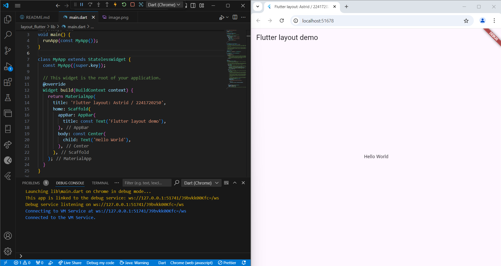
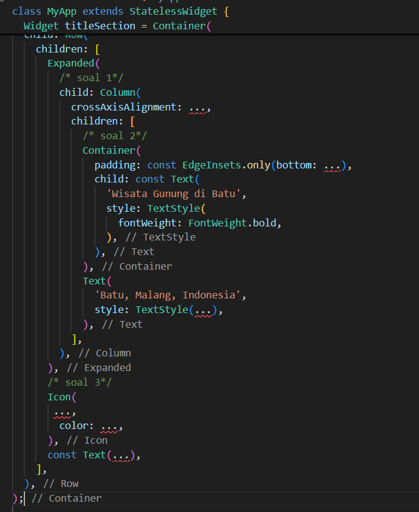
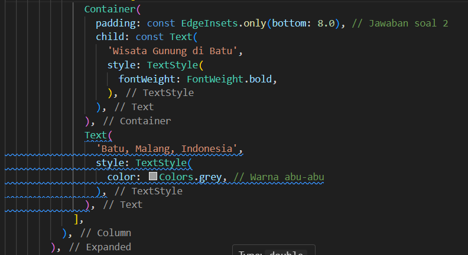
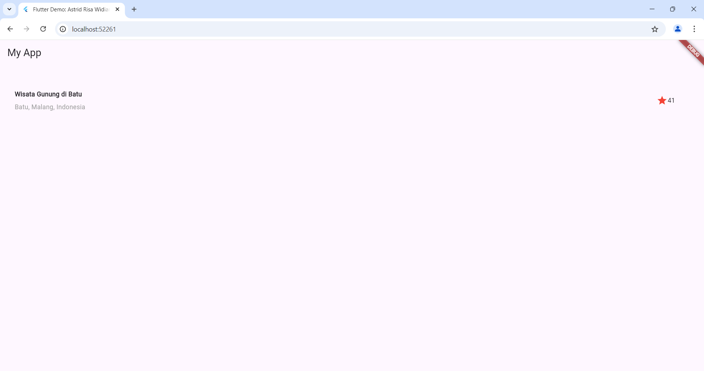
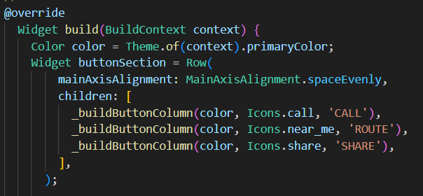
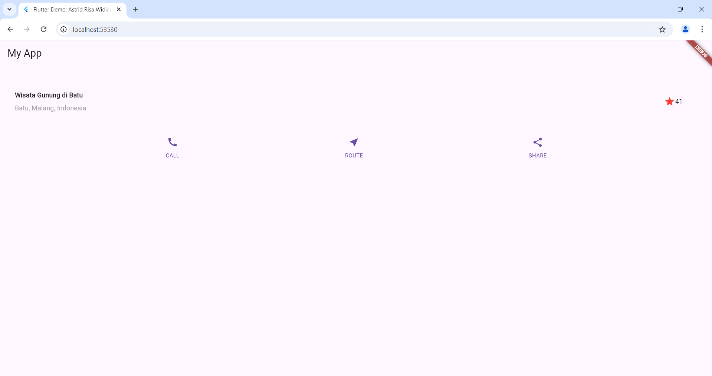

# **Pertemuan 6 - Layout dan Navigasi**

# **TUGAS PRAKTIKUM 1**
1. Selesaikan Praktikum 1 sampai 4, lalu dokumentasikan dan push ke repository Anda berupa screenshot setiap hasil pekerjaan beserta penjelasannya di file README.md!

2. Silakan implementasikan di project baru "basic_layout_flutter" dengan mengakses sumber ini: https://docs.flutter.dev/codelabs/layout-basics

3. Kumpulkan link commit repository GitHub Anda kepada dosen yang telah disepakati!

## **PRAKTIKUM 1: Membangun Layout di Flutter**

### **Langkah 1: Buat Project Baru**

Buatlah sebuah project flutter baru dengan nama layout_flutter. Atau sesuaikan style laporan praktikum yang Anda buat.


### **Langkah 2: Buka file lib/main.dart**

Buka file main.dart lalu ganti dengan kode berikut. Isi nama dan NIM Anda di text title.



### **Langkah 3: Identifikasi layout diagram**

Langkah pertama adalah memecah tata letak menjadi elemen dasarnya:

1. Identifikasi baris dan kolom.
2. pakah tata letaknya menyertakan kisi-kisi (grid)?
3. Apakah ada elemen yang tumpang tindih?
4. Apakah UI memerlukan tab?
5. Perhatikan area yang memerlukan alignment, padding, atau borders.

### **Langkah 4: Implementasi title row**

Pertama, Anda akan membuat kolom bagian kiri pada judul. Tambahkan kode berikut di bagian atas metode build() di dalam kelas MyApp:



### **Soal 1**

Letakkan widget Column di dalam widget Expanded agar menyesuaikan ruang yang tersisa di dalam widget Row. Tambahkan properti crossAxisAlignment ke CrossAxisAlignment.start sehingga posisi kolom berada di awal baris.


**Penjelasan:**

'crossAxisAlignment: CrossAxisAlignment.start' pada widget Column digunakan untuk menyusun anak widget agar sejajar ke sisi kiri (awal) dari sumbu horizontal di dalam tata letak kolom.

### **Soal 2**

Letakkan baris pertama teks di dalam Container sehingga memungkinkan Anda untuk menambahkan padding = 8. Teks ‘Batu, Malang, Indonesia' di dalam Column, set warna menjadi abu-abu.



**Penjelasan:**

Menampilkan teks "Wisata Gunung di Batu" dengan huruf tebal dan "Batu, Malang, Indonesia" dengan warna abu-abu, menggunakan padding bawah 8.0 pada container.

### **Soal 3** 

Dua item terakhir di baris judul adalah ikon bintang, set dengan warna merah, dan teks "41". Seluruh baris ada di dalam Container dan beri padding di sepanjang setiap tepinya sebesar 32 piksel. Kemudian ganti isi body text ‘Hello World' dengan variabel titleSection seperti berikut:


**Penjelasan:**

Untuk menampilkan icon star/bintang berwarna merah dan teks "41" dalam sebuah baris, dengan padding 32.0 unit di semua sisi.

### **Hasil Praktikum 1**



### **Kode Program**
```dart
import 'package:flutter/material.dart';

void main() => runApp(MyApp());

class MyApp extends StatelessWidget {
  //Praktikum 1
  Widget titleSection = Container(
    padding: const EdgeInsets.all(32.0),
    child: Row(
      children: [
        Expanded(
          child: Column(
            crossAxisAlignment: CrossAxisAlignment.start, // Jawaban soal 1
            children: [
              Container(
                padding: const EdgeInsets.only(bottom: 8.0), // Jawaban soal 2
                child: const Text(
                  'Wisata Gunung di Batu',
                  style: TextStyle(
                    fontWeight: FontWeight.bold,
                  ),
                ),
              ),
              Text(
                'Batu, Malang, Indonesia',
                style: TextStyle(
                  color: Colors.grey, // Warna abu-abu
                ),
              ),
            ],
          ),
        ),
        Container(
          padding: const EdgeInsets.all(32.0), // Jawaban soal 3
          child: Row(
            children: [
              Icon(
                Icons.star, // Ikon bintang
                color: Colors.red, // Warna merah
              ),
              const Text('41'), // Teks "41"
            ],
          ),
        ),
      ],
    ),
  );

  @override
  Widget build(BuildContext context) {
    return MaterialApp(
      title: 'Flutter Demo: Astrid Risa Widiana / 2241720250',
      home: Scaffold(
        appBar: AppBar(
          title: const Text('My App'),
        ),
        body: Column(
          children: [
            titleSection, // Menampilkan section yang telah dibuat
            // Tambahkan widget lain di sini jika diperlukan
          ],
        ),
      ),
    );
  }  
}
```

## **PRAKTIKUM 2: Implementasi button row**

### **Langkah 1: Buat method Column _buildButtonColumn**

Bagian tombol berisi 3 kolom yang menggunakan tata letak yang sama—sebuah ikon di atas baris teks. Kolom pada baris ini diberi jarak yang sama, dan teks serta ikon diberi warna primer.

Karena kode untuk membangun setiap kolom hampir sama, buatlah metode pembantu pribadi bernama buildButtonColumn(), yang mempunyai parameter warna, Icon dan Text, sehingga dapat mengembalikan kolom dengan widgetnya sesuai dengan warna tertentu.

**lib/main.dart (_buildButtonColumn)**


### **Langkah 2: Buat widget buttonSection**

Buat Fungsi untuk menambahkan ikon langsung ke kolom. Teks berada di dalam Container dengan margin hanya di bagian atas, yang memisahkan teks dari ikon.

Bangun baris yang berisi kolom-kolom ini dengan memanggil fungsi dan set warna, Icon, dan teks khusus melalui parameter ke kolom tersebut. Sejajarkan kolom di sepanjang sumbu utama menggunakan MainAxisAlignment.spaceEvenly untuk mengatur ruang kosong secara merata sebelum, di antara, dan setelah setiap kolom. Tambahkan kode berikut tepat di bawah deklarasi titleSection di dalam metode build():

**lib/main.dart (buttonSection)**



### **Langkah 3: Tambah button section ke body**

Tambahkan variabel buttonSection ke dalam body seperti berikut:


### **Hasil Praktikum 2**



### **Kode Program**
```dart
import 'package:flutter/material.dart';
void main() => runApp(MyApp());

class MyApp extends StatelessWidget {
  //Praktikum 1
  Widget titleSection = Container(
    padding: const EdgeInsets.all(32.0),
    child: Row(
      children: [
        Expanded(
          child: Column(
            crossAxisAlignment: CrossAxisAlignment.start, // Jawaban soal 1
            children: [
              Container(
                padding: const EdgeInsets.only(bottom: 8.0), // Jawaban soal 2
                child: const Text(
                  'Wisata Gunung di Batu',
                  style: TextStyle(
                    fontWeight: FontWeight.bold,
                  ),
                ),
              ),
              Text(
                'Batu, Malang, Indonesia',
                style: TextStyle(
                  color: Colors.grey, // Warna abu-abu
                ),
              ),
            ],
          ),
        ),
        Container(
          padding: const EdgeInsets.all(32.0), // Jawaban soal 3
          child: Row(
            children: [
              Icon(
                Icons.star, // Ikon bintang
                color: Colors.red, // Warna merah
              ),
              const Text('41'), // Teks "41"
            ],
          ),
        ),
      ],
    ),
  );

// Praktikum 2
@override
  Widget build(BuildContext context) {
    //Praktikum 2 Langkah 2
    Color color = Theme.of(context).primaryColor;
    Widget buttonSection = Row(
        mainAxisAlignment: MainAxisAlignment.spaceEvenly,
        children: [
          _buildButtonColumn(color, Icons.call, 'CALL'),
          _buildButtonColumn(color, Icons.near_me, 'ROUTE'),
          _buildButtonColumn(color, Icons.share, 'SHARE'),
        ],
      );

    //Praktikum 2 Langkah 3
    return MaterialApp(
      title: 'Flutter Demo: Astrid Risa Widiana / 2241720250',
      home: Scaffold(
        appBar: AppBar(
          title: const Text('My App'),
        ),
        body: Column(
          children: [
            titleSection, // Menampilkan section yang telah dibuat
            buttonSection,// Praktikum 2 Langkah 3
          ],
        ),
      ),
    );
  }
}

```

## **PRAKTIKUM 3: Implementasi Text Section**

### **Langkah 1: Buat widget textSection**

Tentukan bagian teks sebagai variabel. Masukkan teks ke dalam Container dan tambahkan padding di sepanjang setiap tepinya. Tambahkan kode berikut tepat di bawah deklarasi buttonSection:


Dengan memberi nilai softWrap = true, baris teks akan memenuhi lebar kolom sebelum membungkusnya pada batas kata.

### **Langkah 2: Tambahkan variabel text section ke body**

Tambahkan widget variabel textSection ke dalam body seperti berikut:


### **Hasil Praktikum 3**


## **PRAKTIKUM 4: Implementasi image section**

### **Langkah 1: Siapkan aset gambar**

Anda dapat mencari gambar di internet yang ingin ditampilkan. Buatlah folder images di root project layout_flutter. Masukkan file gambar tersebut ke folder images, lalu set nama file tersebut ke file pubspec.yaml seperti berikut:

Contoh nama file gambar di atas adalah lake.jpg

### **Langkah 2: Tambahkan gambar ke body**

Tambahkan aset gambar ke dalam body seperti berikut:

BoxFit.cover memberi tahu kerangka kerja bahwa gambar harus sekecil mungkin tetapi menutupi seluruh kotak rendernya.

### **Langkah 3: Terakhir, ubah menjadi ListView**

Pada langkah terakhir ini, atur semua elemen dalam ListView, bukan Column, karena ListView mendukung scroll yang dinamis saat aplikasi dijalankan pada perangkat yang resolusinya lebih kecil.

### **Hasil Praktikum 4**


## **PRAKTIKUM 5: Membangun Navigasi di Flutter**

### **Langkah 1: Siapkan project baru**


Sebelum melanjutkan praktikum, buatlah sebuah project baru Flutter dengan nama belanja dan susunan folder seperti pada gambar berikut. Penyusunan ini dimaksudkan untuk mengorganisasi kode dan widget yang lebih mudah.


### **Langkah 2: Mendefinisikan Route**

Buatlah dua buah file dart dengan nama home_page.dart dan item_page.dart pada folder pages. Untuk masing-masing file, deklarasikan class HomePage pada file home_page.dart dan ItemPage pada item_page.dart. Turunkan class dari StatelessWidget. Gambaran potongan kode dapat anda lihat sebagai berikut.


### **Langkah 3: Lengkapi Kode di main.dart**

Setelah kedua halaman telah dibuat dan didefinisikan, bukalah file main.dart. Pada langkah ini anda akan mendefinisikan Route untuk kedua halaman tersebut. Definisi penamaan route harus bersifat unique. Halaman HomePage didefinisikan sebagai /. Dan halaman ItemPage didefinisikan sebagai /item. Untuk mendefinisikan halaman awal, anda dapat menggunakan named argument initialRoute. Gambaran tahapan ini, dapat anda lihat pada potongan kode berikut.


### **Langkah 4: Membuat data model**

Sebelum melakukan perpindahan halaman dari HomePage ke ItemPage, dibutuhkan proses pemodelan data. Pada desain mockup, dibutuhkan dua informasi yaitu nama dan harga. Untuk menangani hal ini, buatlah sebuah file dengan nama item.dart dan letakkan pada folder models. Pada file ini didefinisikan pemodelan data yang dibutuhkan. Ilustrasi kode yang dibutuhkan, dapat anda lihat pada potongan kode berikut.


### **Langkah 5: Lengkapi kode di class HomePage**

Pada halaman HomePage terdapat ListView widget. Sumber data ListView diambil dari model List dari object Item. Gambaran kode yang dibutuhkan untuk melakukan definisi model dapat anda lihat sebagai berikut.


### **Langkah 6: Membuat ListView dan itemBuilder**

Untuk menampilkan ListView pada praktikum ini digunakan itemBuilder. Data diambil dari definisi model yang telah dibuat sebelumnya. Untuk menunjukkan batas data satu dan berikutnya digunakan widget Card. Kode yang telah umum pada bagian ini tidak ditampilkan. Gambaran kode yang dibutuhkan dapat anda lihat sebagai berikut.


### **Jalankan aplikasi pada emulator atau pada device anda.**


### **Langkah 7: Menambahkan aksi pada ListView**

Item pada ListView saat ini ketika ditekan masih belum memberikan aksi tertentu. Untuk menambahkan aksi pada ListView dapat digunakan widget InkWell atau GestureDetector. Perbedaan utamanya InkWell merupakan material widget yang memberikan efek ketika ditekan. Sedangkan GestureDetector bersifat umum dan bisa juga digunakan untuk gesture lain selain sentuhan. Pada praktikum ini akan digunakan widget InkWell.

Untuk menambahkan sentuhan, letakkan cursor pada widget pembuka Card. Kemudian gunakan shortcut quick fix dari VSCode (Ctrl + . pada Windows atau Cmd + . pada MacOS). Sorot menu wrap with widget... Ubah nilai widget menjadi InkWell serta tambahkan named argument onTap yang berisi fungsi untuk berpindah ke halaman ItemPage. Ilustrasi potongan kode dapat anda lihat pada potongan berikut.


### **Hasil Praktikum 5**

   


# **Tugas Praktikum 2**

1. Untuk melakukan pengiriman data ke halaman berikutnya, cukup menambahkan informasi arguments pada penggunaan Navigator. Perbarui kode pada bagian Navigator menjadi seperti berikut.

    `Navigator.pushNamed(context, '/item', arguments: item);`

    **Penambahan Kode**

    

2. Pembacaan nilai yang dikirimkan pada halaman sebelumnya dapat dilakukan menggunakan ModalRoute. Tambahkan kode berikut pada blok fungsi build dalam halaman ItemPage. Setelah nilai didapatkan, anda dapat menggunakannya seperti penggunaan variabel pada umumnya. (https://docs.flutter.dev/cookbook/navigation/navigate-with-arguments)

    `final itemArgs = ModalRoute.of(context)!.settings.arguments as Item;`

    **Penambahan Kode**

    

3. Pada hasil akhir dari aplikasi belanja yang telah anda selesaikan, tambahkan atribut foto produk, stok, dan rating. Ubahlah tampilan menjadi GridView seperti di aplikasi marketplace pada umumnya.

4. Silakan implementasikan Hero widget pada aplikasi belanja Anda dengan mempelajari dari sumber ini: https://docs.flutter.dev/cookbook/navigation/hero-animations

5. Sesuaikan dan modifikasi tampilan sehingga menjadi aplikasi yang menarik. Selain itu, pecah widget menjadi kode yang lebih kecil. Tambahkan Nama dan NIM di footer aplikasi belanja Anda.

6. Selesaikan Praktikum 5: Navigasi dan Rute tersebut. Cobalah modifikasi menggunakan plugin go_router, lalu dokumentasikan dan push ke repository Anda berupa screenshot setiap hasil pekerjaan beserta penjelasannya di file README.md. Kumpulkan link commit repository GitHub Anda kepada dosen yang telah disepakati!