# **Pertemuan 6 - Layout dan Navigasi**

# **TUGAS PRAKTIKUM 1**
1. Selesaikan Praktikum 1 sampai 4, lalu dokumentasikan dan push ke repository Anda berupa screenshot setiap hasil pekerjaan beserta penjelasannya di file README.md!

2. Silakan implementasikan di project baru "basic_layout_flutter" dengan mengakses sumber ini: https://docs.flutter.dev/codelabs/layout-basics

3. Kumpulkan link commit repository GitHub Anda kepada dosen yang telah disepakati!

## **PRAKTIKUM 1: Membangun Layout di Flutter**

### **Langkah 1: Buat Project Baru**

Buatlah sebuah project flutter baru dengan nama layout_flutter. Atau sesuaikan style laporan praktikum yang Anda buat.

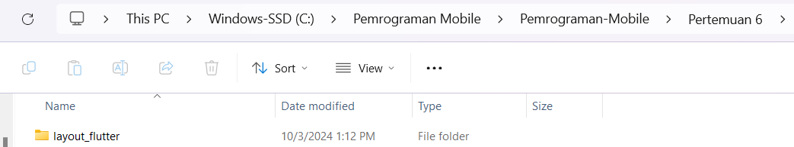

### **Langkah 2: Buka file lib/main.dart**

Buka file main.dart lalu ganti dengan kode berikut. Isi nama dan NIM Anda di text title.

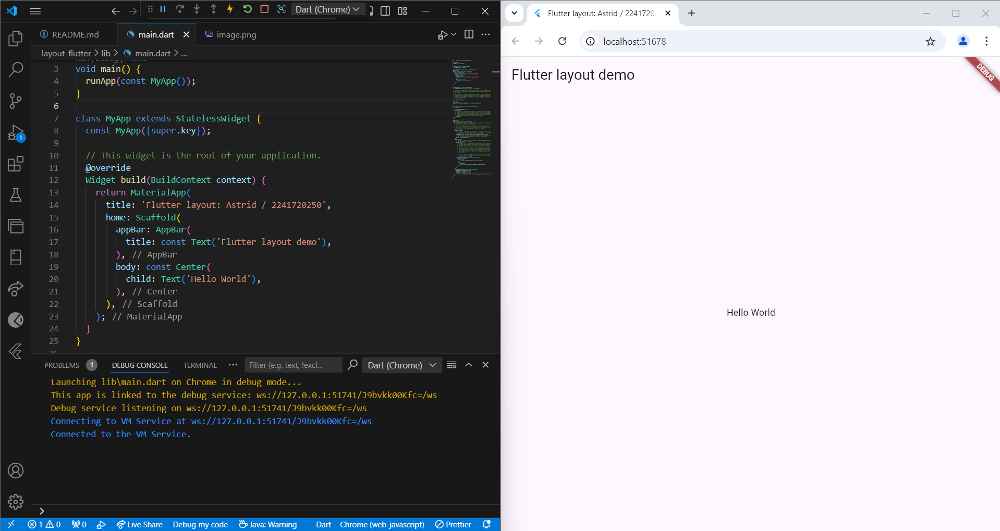

### **Langkah 3: Identifikasi layout diagram**

Langkah pertama adalah memecah tata letak menjadi elemen dasarnya:

1. Identifikasi baris dan kolom.
2. pakah tata letaknya menyertakan kisi-kisi (grid)?
3. Apakah ada elemen yang tumpang tindih?
4. Apakah UI memerlukan tab?
5. Perhatikan area yang memerlukan alignment, padding, atau borders.

### **Langkah 4: Implementasi title row**

Pertama, Anda akan membuat kolom bagian kiri pada judul. Tambahkan kode berikut di bagian atas metode build() di dalam kelas MyApp:

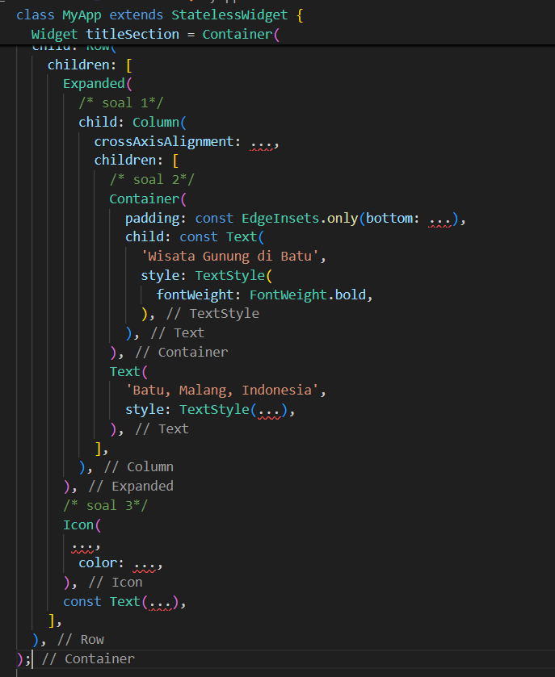

### **Soal 1**

Letakkan widget Column di dalam widget Expanded agar menyesuaikan ruang yang tersisa di dalam widget Row. Tambahkan properti crossAxisAlignment ke CrossAxisAlignment.start sehingga posisi kolom berada di awal baris.

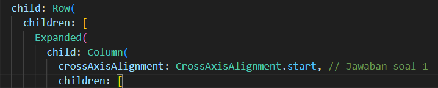

**Penjelasan:**

'crossAxisAlignment: CrossAxisAlignment.start' pada widget Column digunakan untuk menyusun anak widget agar sejajar ke sisi kiri (awal) dari sumbu horizontal di dalam tata letak kolom.

### **Soal 2**

Letakkan baris pertama teks di dalam Container sehingga memungkinkan Anda untuk menambahkan padding = 8. Teks ‘Batu, Malang, Indonesia' di dalam Column, set warna menjadi abu-abu.

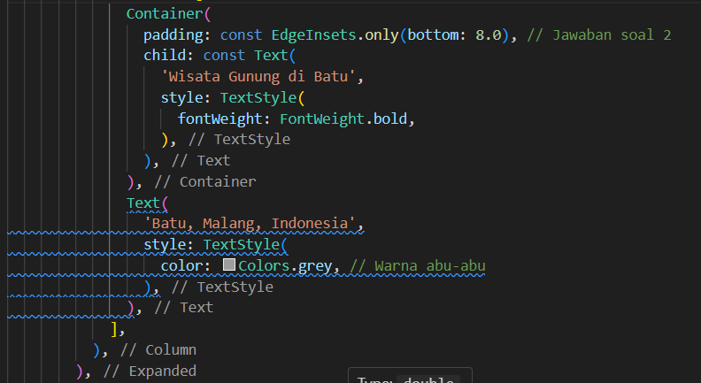

**Penjelasan:**

Menampilkan teks "Wisata Gunung di Batu" dengan huruf tebal dan "Batu, Malang, Indonesia" dengan warna abu-abu, menggunakan padding bawah 8.0 pada container.

### **Soal 3** 

Dua item terakhir di baris judul adalah ikon bintang, set dengan warna merah, dan teks "41". Seluruh baris ada di dalam Container dan beri padding di sepanjang setiap tepinya sebesar 32 piksel. Kemudian ganti isi body text ‘Hello World' dengan variabel titleSection seperti berikut:

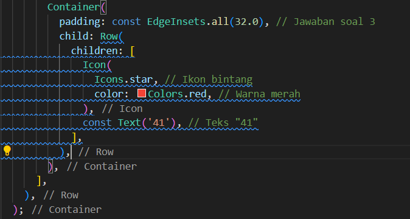

**Penjelasan:**

Untuk menampilkan icon star/bintang berwarna merah dan teks "41" dalam sebuah baris, dengan padding 32.0 unit di semua sisi.

### **Hasil Praktikum 1**

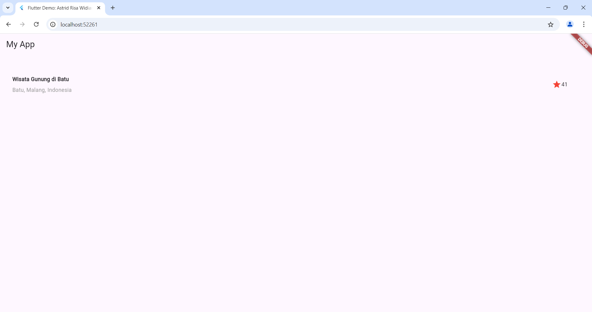

### **Kode Program**
```dart
import 'package:flutter/material.dart';

void main() => runApp(MyApp());

class MyApp extends StatelessWidget {
  //Praktikum 1
  Widget titleSection = Container(
    padding: const EdgeInsets.all(32.0),
    child: Row(
      children: [
        Expanded(
          child: Column(
            crossAxisAlignment: CrossAxisAlignment.start, // Jawaban soal 1
            children: [
              Container(
                padding: const EdgeInsets.only(bottom: 8.0), // Jawaban soal 2
                child: const Text(
                  'Wisata Gunung di Batu',
                  style: TextStyle(
                    fontWeight: FontWeight.bold,
                  ),
                ),
              ),
              Text(
                'Batu, Malang, Indonesia',
                style: TextStyle(
                  color: Colors.grey, // Warna abu-abu
                ),
              ),
            ],
          ),
        ),
        Container(
          padding: const EdgeInsets.all(32.0), // Jawaban soal 3
          child: Row(
            children: [
              Icon(
                Icons.star, // Ikon bintang
                color: Colors.red, // Warna merah
              ),
              const Text('41'), // Teks "41"
            ],
          ),
        ),
      ],
    ),
  );

  @override
  Widget build(BuildContext context) {
    return MaterialApp(
      title: 'Flutter Demo: Astrid Risa Widiana / 2241720250',
      home: Scaffold(
        appBar: AppBar(
          title: const Text('My App'),
        ),
        body: Column(
          children: [
            titleSection, // Menampilkan section yang telah dibuat
            // Tambahkan widget lain di sini jika diperlukan
          ],
        ),
      ),
    );
  }  
}
```

## **PRAKTIKUM 2: Implementasi button row**

### **Langkah 1: Buat method Column _buildButtonColumn**

Bagian tombol berisi 3 kolom yang menggunakan tata letak yang sama—sebuah ikon di atas baris teks. Kolom pada baris ini diberi jarak yang sama, dan teks serta ikon diberi warna primer.

Karena kode untuk membangun setiap kolom hampir sama, buatlah metode pembantu pribadi bernama buildButtonColumn(), yang mempunyai parameter warna, Icon dan Text, sehingga dapat mengembalikan kolom dengan widgetnya sesuai dengan warna tertentu.

**lib/main.dart (_buildButtonColumn)**

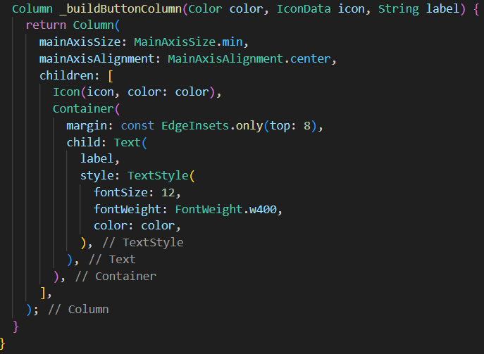

### **Langkah 2: Buat widget buttonSection**

Buat Fungsi untuk menambahkan ikon langsung ke kolom. Teks berada di dalam Container dengan margin hanya di bagian atas, yang memisahkan teks dari ikon.

Bangun baris yang berisi kolom-kolom ini dengan memanggil fungsi dan set warna, Icon, dan teks khusus melalui parameter ke kolom tersebut. Sejajarkan kolom di sepanjang sumbu utama menggunakan MainAxisAlignment.spaceEvenly untuk mengatur ruang kosong secara merata sebelum, di antara, dan setelah setiap kolom. Tambahkan kode berikut tepat di bawah deklarasi titleSection di dalam metode build():

**lib/main.dart (buttonSection)**

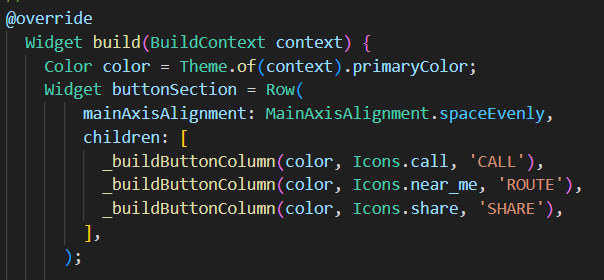

### **Langkah 3: Tambah button section ke body**

Tambahkan variabel buttonSection ke dalam body seperti berikut:

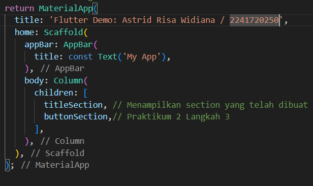

### **Hasil Praktikum 2**

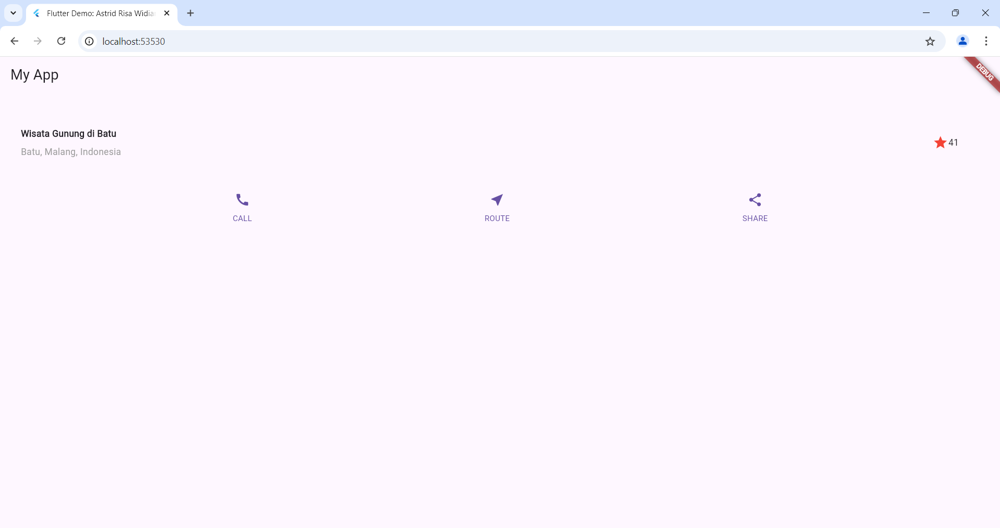

### **Kode Program**
```dart
import 'package:flutter/material.dart';
void main() => runApp(MyApp());

class MyApp extends StatelessWidget {
  //Praktikum 1
  Widget titleSection = Container(
    padding: const EdgeInsets.all(32.0),
    child: Row(
      children: [
        Expanded(
          child: Column(
            crossAxisAlignment: CrossAxisAlignment.start, // Jawaban soal 1
            children: [
              Container(
                padding: const EdgeInsets.only(bottom: 8.0), // Jawaban soal 2
                child: const Text(
                  'Wisata Gunung di Batu',
                  style: TextStyle(
                    fontWeight: FontWeight.bold,
                  ),
                ),
              ),
              Text(
                'Batu, Malang, Indonesia',
                style: TextStyle(
                  color: Colors.grey, // Warna abu-abu
                ),
              ),
            ],
          ),
        ),
        Container(
          padding: const EdgeInsets.all(32.0), // Jawaban soal 3
          child: Row(
            children: [
              Icon(
                Icons.star, // Ikon bintang
                color: Colors.red, // Warna merah
              ),
              const Text('41'), // Teks "41"
            ],
          ),
        ),
      ],
    ),
  );

// Praktikum 2
@override
  Widget build(BuildContext context) {
    //Praktikum 2 Langkah 2
    Color color = Theme.of(context).primaryColor;
    Widget buttonSection = Row(
        mainAxisAlignment: MainAxisAlignment.spaceEvenly,
        children: [
          _buildButtonColumn(color, Icons.call, 'CALL'),
          _buildButtonColumn(color, Icons.near_me, 'ROUTE'),
          _buildButtonColumn(color, Icons.share, 'SHARE'),
        ],
      );

    //Praktikum 2 Langkah 3
    return MaterialApp(
      title: 'Flutter Demo: Astrid Risa Widiana / 2241720250',
      home: Scaffold(
        appBar: AppBar(
          title: const Text('My App'),
        ),
        body: Column(
          children: [
            titleSection, // Menampilkan section yang telah dibuat
            buttonSection,// Praktikum 2 Langkah 3
          ],
        ),
      ),
    );
  }
}

```

## **PRAKTIKUM 3: Implementasi Text Section**

### **Langkah 1: Buat widget textSection**

Tentukan bagian teks sebagai variabel. Masukkan teks ke dalam Container dan tambahkan padding di sepanjang setiap tepinya. Tambahkan kode berikut tepat di bawah deklarasi buttonSection:

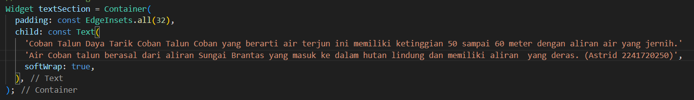

Dengan memberi nilai softWrap = true, baris teks akan memenuhi lebar kolom sebelum membungkusnya pada batas kata.

### **Langkah 2: Tambahkan variabel text section ke body**

Tambahkan widget variabel textSection ke dalam body seperti berikut:

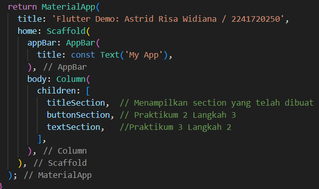

### **Hasil Praktikum 3**

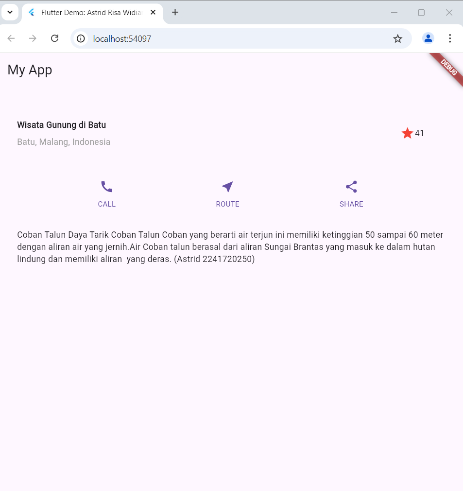


## **PRAKTIKUM 4: Implementasi image section**

### **Langkah 1: Siapkan aset gambar**

Anda dapat mencari gambar di internet yang ingin ditampilkan. Buatlah folder images di root project layout_flutter. Masukkan file gambar tersebut ke folder images, lalu set nama file tersebut ke file pubspec.yaml seperti berikut:

Contoh nama file gambar di atas adalah lake.jpg

### **Langkah 2: Tambahkan gambar ke body**

Tambahkan aset gambar ke dalam body seperti berikut:

BoxFit.cover memberi tahu kerangka kerja bahwa gambar harus sekecil mungkin tetapi menutupi seluruh kotak rendernya.

### **Langkah 3: Terakhir, ubah menjadi ListView**

Pada langkah terakhir ini, atur semua elemen dalam ListView, bukan Column, karena ListView mendukung scroll yang dinamis saat aplikasi dijalankan pada perangkat yang resolusinya lebih kecil.

### **Hasil Praktikum 4**

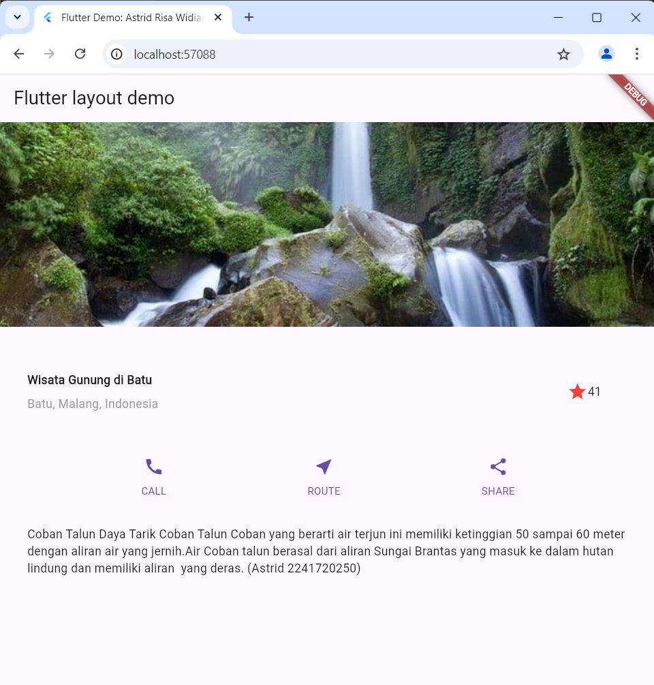