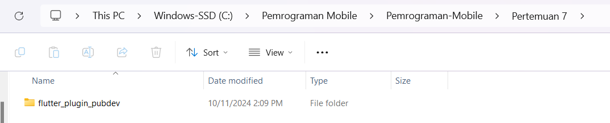
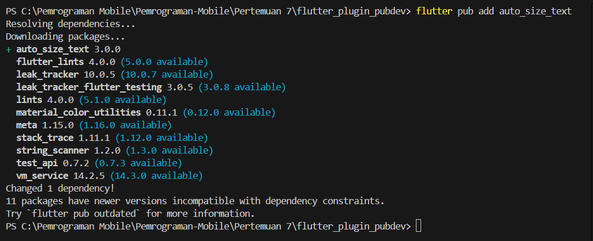
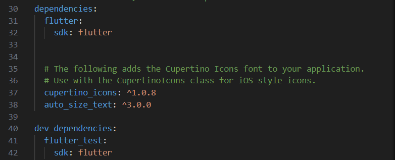
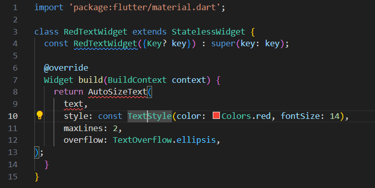
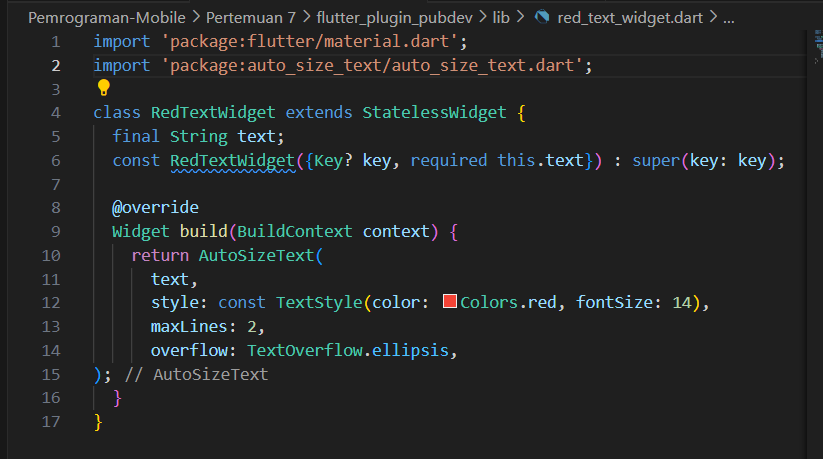
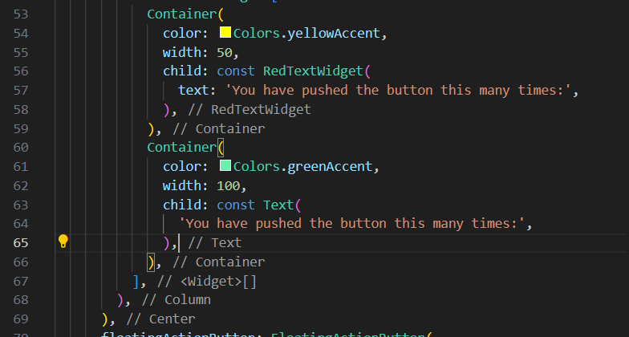
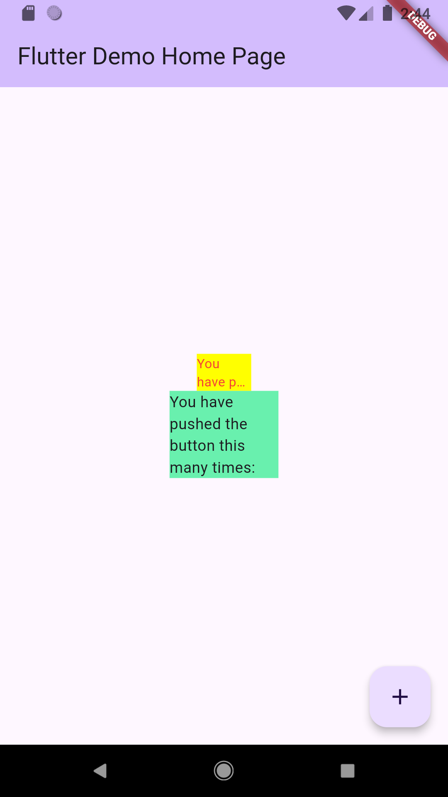

# **Pertemuan 7 Manajemen Plugin**

## **Praktikum Menerapkan Plugin di Project Flutter**

### **Langkah 1: Buat Project Baru**

Buatlah sebuah project flutter baru dengan nama flutter_plugin_pubdev. Lalu jadikan repository di GitHub Anda dengan nama flutter_plugin_pubdev.



### **Langkah 2: Menambahkan Plugin**

Tambahkan plugin auto_size_text menggunakan perintah berikut di terminal

`flutter pub add auto_size_text`



Jika berhasil, maka akan tampil nama plugin beserta versinya di file pubspec.yaml pada bagian dependencies.



### **Langkah 3: Buat file red_text_widget.dart**

Buat file baru bernama ***red_text_widget.dart*** di dalam folder lib lalu isi kode seperti berikut.

import 'package:flutter/material.dart';

```dart
class RedTextWidget extends StatelessWidget {
  const RedTextWidget({Key? key}) : super(key: key);

  @override
  Widget build(BuildContext context) {
    return Container();
  }
}
```

### **Langkah 4: Tambah Widget AutoSizeText**

Masih di file red_text_widget.dart, untuk menggunakan plugin auto_size_text, ubahlah kode return Container() menjadi seperti berikut.

```dart
    return AutoSizeText(
      text,
      style: const TextStyle(color: Colors.red, fontSize: 14),
      maxLines: 2,
      overflow: TextOverflow.ellipsis,
    );
```
**Hasil Kode Program**



```dart
import 'package:flutter/material.dart';
import 'package:auto_size_text/auto_size_text.dart';

class RedTextWidget extends StatelessWidget {
  const RedTextWidget({Key? key}) : super(key: key);

  @override
  Widget build(BuildContext context) {
    return AutoSizeText(
      text,
      style: const TextStyle(color: Colors.red, fontSize: 14),
      maxLines: 2,
      overflow: TextOverflow.ellipsis,
    );
  }
}

```
Setelah Anda menambahkan kode di atas, Anda akan mendapatkan info error. Mengapa demikian? Jelaskan dalam laporan praktikum Anda!

**Jawab:**

Alasan kenapa muncul error setelah menambahkan AutoSizeText adalah karena belum mengimpor package auto_size_text. Flutter tidak secara otomatis mengetahui bahwa plugin ini digunakan di dalam project, jadi perlu menambahkan import di bagian atas file red_text_widget.dart seperti berikut: `import 'package:auto_size_text/auto_size_text.dart';`

### **Langkah 5: Buat Variabel text dan parameter di constructor**

Tambahkan variabel text dan parameter di constructor seperti berikut.

```dart
final String text;

const RedTextWidget({Key? key, required this.text}) : super(key: key);
```
**Hasil Kode Program**



```dart
import 'package:flutter/material.dart';
import 'package:auto_size_text/auto_size_text.dart';

class RedTextWidget extends StatelessWidget {
  final String text;
  const RedTextWidget({Key? key, required this.text}) : super(key: key);

  @override
  Widget build(BuildContext context) {
    return AutoSizeText(
      text,
      style: const TextStyle(color: Colors.red, fontSize: 14),
      maxLines: 2,
      overflow: TextOverflow.ellipsis,
    );
  }
}           

```
### **Langkah 6: Tambahkan widget di main.dart**

Buka file main.dart lalu tambahkan di dalam children: pada class _MyHomePageState

```dart
Container(
   color: Colors.yellowAccent,
   width: 50,
   child: const RedTextWidget(
             text: 'You have pushed the button this many times:',
          ),
),
Container(
    color: Colors.greenAccent,
    width: 100,
    child: const Text(
           'You have pushed the button this many times:',
          ),
),
```

**Hasil Kode Program**



```dart
import 'package:flutter/material.dart';
import 'package:flutter_plugin_pubdev/red_text_widget.dart';

void main() {
  runApp(const MyApp());
}

class MyApp extends StatelessWidget {
  const MyApp({super.key});
  // This widget is the root of your application.
  @override
  Widget build(BuildContext context) {
    return MaterialApp(
      title: 'Flutter Demo',
      theme: ThemeData(
        colorScheme: ColorScheme.fromSeed(seedColor: Colors.deepPurple),
        useMaterial3: true,
      ),
      home: const MyHomePage(title: 'Flutter Demo Home Page'),
    );
  }
}

class MyHomePage extends StatefulWidget {
  const MyHomePage({super.key, required this.title});

  final String title;

  @override
  State<MyHomePage> createState() => _MyHomePageState();
}

class _MyHomePageState extends State<MyHomePage> {
  int _counter = 0;

  void _incrementCounter() {
    setState(() {
      _counter++;
    });
  }

  @override
  Widget build(BuildContext context) {
    return Scaffold(
      appBar: AppBar(
        backgroundColor: Theme.of(context).colorScheme.inversePrimary,
        title: Text(widget.title),
      ),
       body: Center(
        child: Column(
          mainAxisAlignment: MainAxisAlignment.center,
          children: <Widget>[
            Container(
              color: Colors.yellowAccent,
              width: 50,
              child: const RedTextWidget(
                text: 'You have pushed the button this many times:',
              ),
            ),
            Container(
              color: Colors.greenAccent,
              width: 100,
              child: const Text(
                'You have pushed the button this many times:',
              ),
            ),
          ],
        ),
      ),
      floatingActionButton: FloatingActionButton(
        onPressed: _incrementCounter,
        tooltip: 'Increment',
        child: const Icon(Icons.add),
      ),
    );
  }
}
```

Run aplikasi tersebut dengan tekan F5, maka hasilnya akan seperti berikut.

### **Hasil Praktikum**




# **Tugas Praktikum**

### **1. Selesaikan Praktikum tersebut, lalu dokumentasikan dan push ke repository Anda berupa screenshot hasil pekerjaan beserta penjelasannya di file README.md!**

### **2. Jelaskan maksud dari langkah 2 pada praktikum tersebut!**

### **Jawab:**

Pada langkah ini, diminta menambahkan plugin **auto_size_text** menggunakan perintah flutter pub add **auto_size_text**. Ini adalah langkah untuk menambahkan dependency pada project Flutter. Ketika menjalankan perintah ini, Flutter secara otomatis menambahkan plugin tersebut ke dalam file **pubspec.yaml** di bagian **dependencies**, sehingga kamu dapat menggunakan fitur dari plugin itu di dalam project. **auto_size_text **digunakan untuk membuat teks yang bisa menyesuaikan ukurannya secara otomatis berdasarkan ruang yang tersedia.

### **3. Jelaskan maksud dari langkah 5 pada praktikum tersebut!**

### **Jawab:**

Variabel **final String text** mendefinisikan bahwa widget **RedTextWidget** akan menerima sebuah nilai teks (String). Dengan menambahkan variabel text dan parameter di constructor, widget **RedTextWidget** sekarang bisa menampilkan teks yang dapat disesuaikan berdasarkan kebutuhan. Hal ini membuat widget lebih fleksibel dan reusable dalam berbagai konteks tanpa perlu mendefinisikan ulang widget untuk setiap teks yang berbeda.

### **4. Pada langkah 6 terdapat dua widget yang ditambahkan, jelaskan fungsi dan perbedaannya!**

### **Jawab:**

Pada langkah 6, menambahkan dua widget Container yang masing-masing berisi RedTextWidget dan Text.

**RedTextWidget:** Ini adalah widget kustom yang kamu buat, yang menggunakan AutoSizeText untuk menampilkan teks dengan ukuran yang otomatis menyesuaikan berdasarkan ruang yang tersedia. Jika teksnya terlalu panjang, maka akan menampilkan teks dengan ukuran lebih kecil atau memotongnya dengan tanda ellipsis (...) jika ruang terbatas.

**Text:** Ini adalah widget Flutter standar yang digunakan untuk menampilkan teks statis. Dalam contoh ini, teksnya akan ditampilkan apa adanya dengan ukuran tetap, tanpa penyesuaian otomatis.

**Perbedaan:**

- **RedTextWidget** menggunakan AutoSizeText, yang memungkinkan teks menyesuaikan ukurannya berdasarkan ruang yang tersedia.

- **Text** adalah widget biasa yang tidak memiliki fitur penyesuaian otomatis. Teks yang lebih panjang dari ruang yang tersedia tidak akan otomatis menyesuaikan, kecuali ditentukan secara manual.


### **5. Jelaskan maksud dari tiap parameter yang ada di dalam plugin auto_size_text berdasarkan tautan pada dokumentasi ini !**

### **Jawab:**

Berdasarkan dokumentasi plugin auto_size_text, berikut adalah beberapa parameter penting:

1. **text:** Ini adalah teks yang akan ditampilkan oleh widget.

2. **style:** Digunakan untuk mengatur gaya teks seperti warna, ukuran font, dan lain-lain. Pada contoh di praktikum, warnanya merah (Colors.red).

3. **maxLines:** Menentukan jumlah baris maksimum yang diizinkan untuk teks. Jika teks lebih panjang dari yang bisa ditampung dalam baris ini, maka teks akan dipotong.

3. **overflow:** Menentukan bagaimana teks akan dipotong jika lebih panjang dari ruang yang tersedia. Pada contoh di praktikum, diatur dengan TextOverflow.ellipsis, yang menampilkan tiga titik (...) di akhir teks yang terpotong.

### **6. Kumpulkan laporan praktikum Anda berupa link repository GitHub kepada dosen!**