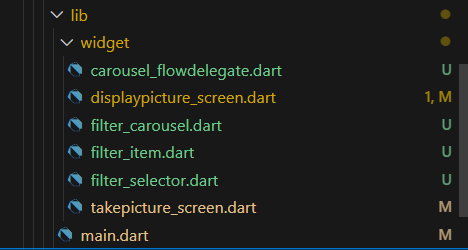

# **Tugas Praktikum**
1. Selesaikan Praktikum 1 dan 2, lalu dokumentasikan dan push ke repository Anda berupa screenshot setiap hasil pekerjaan beserta penjelasannya di file README.md! Jika terdapat error atau kode yang tidak dapat berjalan, 2.2.2. silakan Anda perbaiki sesuai tujuan aplikasi dibuat!

    **Praktikum 1**

    https://github.com/astridrisa/Pemrograman-Mobile/blob/21477594b424f6533dfcdd86b345353c8c0feccf/Pertemuan%209/kamera_flutter/README.md

    **Praktikum 2**

    https://github.com/astridrisa/Pemrograman-Mobile/blob/21477594b424f6533dfcdd86b345353c8c0feccf/Pertemuan%209/photo_filter_carousel/README.md


2. Gabungkan hasil praktikum 1 dengan hasil praktikum 2 sehingga setelah melakukan pengambilan foto, dapat dibuat filter carouselnya!

   **Jawab:**

   1. Update Struktur Project
    Pastikan proyek dari Praktikum 1 dan Praktikum 2 sudah berada dalam satu project. Jika Praktikum 1 dan Praktikum 2 terpisah, salin kode dari Praktikum 2 ke dalam folder lib Praktikum 1. Pastikan Anda menyalin semua file widget yang dibutuhkan seperti filter_selector.dart, filter_carousel.dart, dan carousel_flowdelegate.dart.
    
    

    2. Tambahkan Logika untuk Pengambilan Gambar dan Filter
    Gabungkan logika pengambilan gambar dari Praktikum 1 ke dalam struktur Praktikum 2 yang menggunakan filter carousel. Berikut adalah langkah-langkahnya:

    **Langkah-langkah Penggabungan**

    1. Import Libraries yang Diperlukan Tambahkan import ImagePicker dari Praktikum 1 untuk pengambilan gambar.

    2. Modifikasi PhotoFilterCarousel Pada file lib/widget/filter_carousel.dart, sesuaikan kode agar dapat memproses gambar yang diambil menggunakan ImagePicker.

    3. Tambahkan Fungsi Pengambilan Gambar Pada PhotoFilterCarousel, tambahkan tombol untuk membuka ImagePicker dan menyimpan gambar yang dipilih.

    PhotoFilterCarousel yang telah dimodifikasi:

    **file displaypicture_screen.dart**

    ```dart
        import 'dart:io';

        import 'package:flutter/material.dart';
        import 'package:kamera_flutter/widget/filter_carousel.dart';

        class DisplayPictureScreen extends StatelessWidget {
        final String imagePath;
        const DisplayPictureScreen({super.key, required this.imagePath});

        @override
        Widget build(BuildContext context) {
            return Scaffold(
            appBar: AppBar(title: const Text('Display the Picture - 2241720250')),
            body: PhotoFilterCarousel(filePath: imagePath),
            );
        }
        }
    ```

    **file filter_carousel.dart**
    
    ```dart
    import 'dart:io';

    import 'package:flutter/material.dart';
    import 'package:kamera_flutter/widget/filter_selector.dart';

    @immutable
    class PhotoFilterCarousel extends StatefulWidget {
    const PhotoFilterCarousel({super.key, required this.filePath});
    final String filePath;
    @override
    State<PhotoFilterCarousel> createState() => _PhotoFilterCarouselState();
    }

    class _PhotoFilterCarouselState extends State<PhotoFilterCarousel> {
    final _filters = [
        Colors.white,
        ...List.generate(
        Colors.primaries.length,
            (index) => Colors.primaries[(index * 4) % Colors.primaries.length],
        )
    ];

    final _filterColor = ValueNotifier<Color>(Colors.white);

    void _onFilterChanged(Color value) {
        _filterColor.value = value;
    }

    @override
    Widget build(BuildContext context) {
        return Material(
        color: Colors.black,
        child: Stack(
            children: [
            Positioned.fill(
                child: _buildPhotoWithFilter(widget.filePath),
            ),
            Positioned(
                left: 0.0,
                right: 0.0,
                bottom: 0.0,
                child: _buildFilterSelector(),
            ),
            ],
        ),
        );
    }

    Widget _buildPhotoWithFilter(String filePath) {
        return ValueListenableBuilder(
        valueListenable: _filterColor,
        builder: (context, color, child) {
            // Anda bisa ganti dengan foto Anda sendiri
            return Image.file(
            File(filePath),
            color: color.withOpacity(0.5),
            colorBlendMode: BlendMode.color,
            fit: BoxFit.cover,
            );
        },
        );
    }

    Widget _buildFilterSelector() {
        return FilterSelector(
        onFilterChanged: _onFilterChanged,
        filters: _filters,
        );
    }
    }
    ```

   **Hasil**

   <video controls src="img/HasilTugas.mp4" title="Title"></video>

3. Jelaskan maksud void async pada praktikum 1?

   **Jawab:**

   void async digunakan untuk mendefinisikan fungsi asynchronous. Dalam praktikum 1, ini memungkinkan proses seperti pengambilan gambar berjalan di latar belakang tanpa membekukan antarmuka pengguna (UI). Misalnya, pengambilan gambar dari ImagePicker adalah proses yang bisa memakan waktu, dan menggunakan async membantu agar aplikasi tetap responsif saat proses berjalan.

4. Jelaskan fungsi dari anotasi @immutable dan   @override ?
    **Jawab:**

    **@immutable:** Anotasi ini menandakan bahwa suatu kelas bersifat immutable atau tidak dapat diubah setelah dibuat. Pada widget, ini berarti semua variabelnya harus bersifat final. Misalnya, FilterSelector menggunakan anotasi ini untuk memastikan widget tersebut tidak dapat dimodifikasi setelah diinisialisasi.

    **@override:** Anotasi ini digunakan ketika sebuah metode dalam subclass menimpa metode dari superclass. Ini membantu mengonfirmasi bahwa metode yang dideklarasikan ada dalam superclass, sehingga dapat meminimalkan kesalahan jika nama metode dalam superclass diubah.


5. Kumpulkan link commit repository GitHub Anda kepada dosen yang telah disepakati!